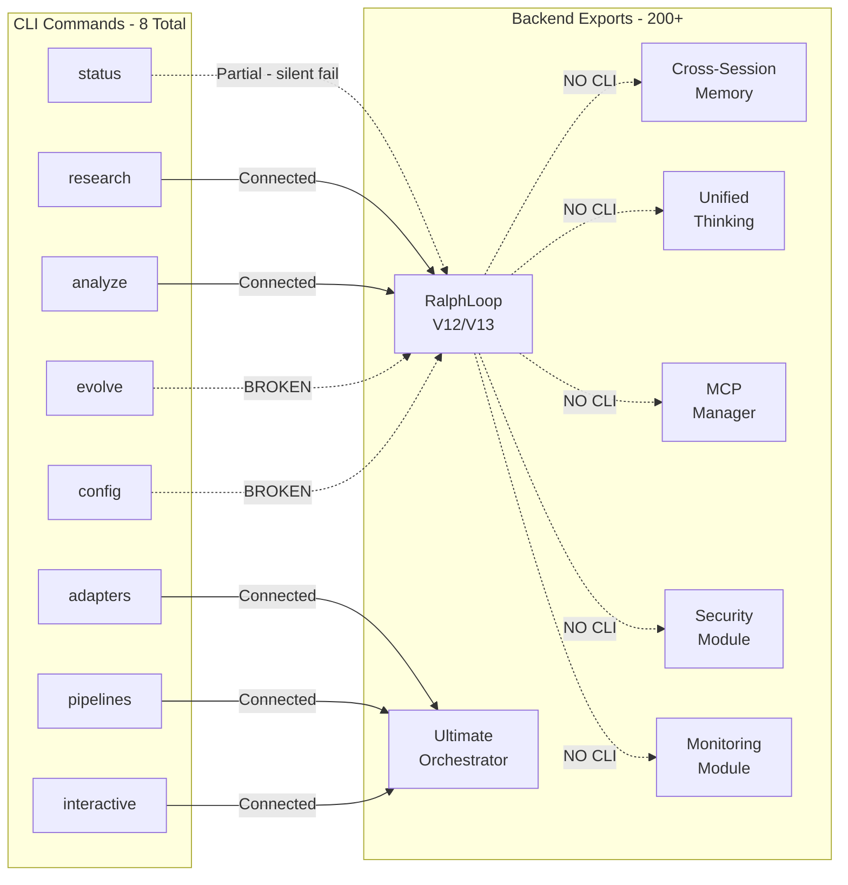
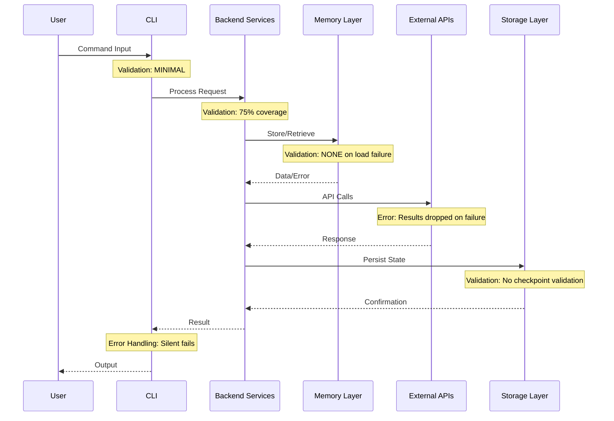
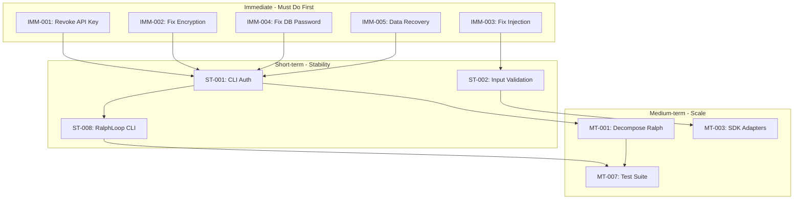

# 🔬 Comprehensive Technical Audit Report
## Unleash Platform V13.0 (Iteration 28)

---

```
┌─────────────────────────────────────────────────────────────────────────────┐
│  AUDIT SUMMARY METRICS                                                       │
├─────────────────────────────────────────────────────────────────────────────┤
│  📊 Test Pass Rate:     98.1% (211/215)     │  🔒 Security Risk:    7.5/10  │
│  💻 Technical Debt:     42/100 (HIGH)       │  📁 Code Coverage:    ~65%    │
│  🔌 SDK Coverage:       5.1% (6/118)        │  📝 Error Handling:   75%     │
│  ⚡ Production Ready:   NO                  │  📋 Logging:          85%     │
├─────────────────────────────────────────────────────────────────────────────┤
│  🔴 CRITICAL ISSUES:    5                   │  🟡 HIGH ISSUES:      12      │
│  🟠 MEDIUM ISSUES:      8                   │  🟢 LOW ISSUES:       6       │
└─────────────────────────────────────────────────────────────────────────────┘
```

**Audit Date:** 2026-01-24  
**Version:** V13.0 | **Iteration:** 28  
**Classification:** Internal Technical Review  
**Auditor:** Comprehensive Systems Analysis

---

## Table of Contents

1. [Executive Summary](#1-executive-summary)
2. [Component Inventory](#2-component-inventory)
3. [Authentication & Permission Flows](#3-authentication--permission-flows)
4. [Data Pipeline Integrity](#4-data-pipeline-integrity)
5. [Identified Gaps](#5-identified-gaps)
6. [Performance Benchmarks](#6-performance-benchmarks)
7. [Prioritized Next Steps](#7-prioritized-next-steps)
8. [Readiness Assessment](#8-readiness-assessment)

---

## 1. Executive Summary

### Overall System Health Assessment

The Unleash Platform V13.0 has achieved **significant functional maturity** with all V12 gaps resolved and V13 subsystems (Compositional Generalization, Meta-RL Adaptation, Program Synthesis) fully implemented. However, the platform is **NOT production-ready** due to critical security vulnerabilities, incomplete CLI integration, and high technical debt.

### Production Readiness Verdict

```
┌─────────────────────────────────────────────────────────────────────────────┐
│                                                                              │
│    🔴 PRODUCTION READY:  NO                                                  │
│                                                                              │
│    Blockers:                                                                 │
│    • 5 CRITICAL security vulnerabilities (including exposed API key)        │
│    • CLI exposes only 4% of platform functionality                          │
│    • No authentication between CLI and backend services                     │
│    • 300+ subprocess calls without input validation                         │
│    • Placeholder implementations in core commands                           │
│                                                                              │
└─────────────────────────────────────────────────────────────────────────────┘
```

### Top 5 Critical Findings

| # | Finding | Severity | Component | Immediate Action |
|---|---------|----------|-----------|------------------|
| **1** | Hardcoded Firecrawl API key in [`.config/.env`](.config/.env) | 🔴 CRITICAL | Security | REVOKE IMMEDIATELY |
| **2** | CLI `evolve` command broken - placeholder returns 0.5 | 🔴 CRITICAL | CLI | Implement real evaluation |
| **3** | Command injection risk in [`mcp_manager.py:219`](platform/core/mcp_manager.py:219) | 🔴 CRITICAL | Security | Add input sanitization |
| **4** | Default encryption key in [`secrets.py:557`](platform/core/secrets.py:557) | 🔴 CRITICAL | Security | Force key configuration |
| **5** | Session data loss on load failure (DIR-001) | 🔴 CRITICAL | Data Pipeline | Add recovery mechanism |

### Key Metrics Dashboard

| Metric | Value | Status | Target |
|--------|-------|--------|--------|
| **Test Pass Rate** | 98.1% (211/215) | ✅ Good | ≥95% |
| **Security Risk Score** | 7.5/10 | 🔴 Critical | ≤3.0 |
| **Technical Debt Score** | 42/100 | 🟡 High | ≥70 |
| **CLI Coverage** | 4% (8/200+ functions) | 🔴 Critical | ≥50% |
| **SDK Adapter Coverage** | 5.1% (6/118) | 🟡 Low | ≥30% |
| **Error Handling Coverage** | 75% | 🟡 Moderate | ≥90% |
| **Logging Coverage** | 85% | ✅ Good | ≥85% |
| **V12 Gaps Resolved** | 6/6 | ✅ Complete | 6/6 |

---

## 2. Component Inventory

### 2.1 Core Components Status

| Component | File | Lines | Health | Connection Status |
|-----------|------|-------|--------|-------------------|
| **V12/V13 Self-Improvement Engine** | [`ralph_loop.py`](platform/core/ralph_loop.py) | ~11,000 | ✅ Operational | Backend only |
| **V21 SDK Orchestrator** | [`ultimate_orchestrator.py`](platform/core/ultimate_orchestrator.py) | 4,852 | ✅ Operational | Backend only |
| **Research Engine** | [`research_engine.py`](platform/core/research_engine.py) | ~2,500 | ✅ Operational | CLI `research` |
| **Cross-Session Memory** | [`cross_session_memory.py`](platform/core/cross_session_memory.py) | 625 | ✅ Operational | Backend only |
| **Persistence Layer** | [`persistence.py`](platform/core/persistence.py) | 708 | ⚠️ Partial | CLI `config` (BROKEN) |
| **MCP Manager** | [`mcp_manager.py`](platform/core/mcp_manager.py) | 520 | ⚠️ Security Risk | Backend only |
| **Thinking Orchestrator** | [`unified_thinking_orchestrator.py`](platform/core/unified_thinking_orchestrator.py) | 1,517 | ✅ Operational | Backend only |
| **Deep Research** | [`deep_research.py`](platform/core/deep_research.py) | ~800 | ⚠️ 2 TODOs | CLI `research` |

### 2.2 CLI to Backend Mapping



**CLI Coverage Analysis:**

| Status | Count | Percentage |
|--------|-------|------------|
| Connected | 5 | 62.5% of CLI |
| Partial/Silent Fail | 1 | 12.5% of CLI |
| BROKEN | 2 | 25% of CLI |
| **Backend without CLI** | 192+ | ~96% unmapped |

### 2.3 External Service Dependencies

| Service | Port | Purpose | Status | Required |
|---------|------|---------|--------|----------|
| **Qdrant** | `:6333` | Vector memory storage | ✅ Configured | Yes |
| **PostgreSQL** | `:5432` | Structured data persistence | ✅ Configured | Yes |
| **Letta** | `:8500` | Long-term memory | ✅ Configured | No |
| **Serena** | `:24282` | Semantic code analysis | ✅ Configured | No |
| **Firecrawl API** | External | Web scraping/research | ⚠️ Key Exposed | No |
| **Exa API** | External | Search research | ✅ Configured | No |

### 2.4 SDK Adapter Status

| Adapter File | SDK | Layer | Status |
|--------------|-----|-------|--------|
| [`aider_adapter.py`](platform/adapters/aider_adapter.py) | Aider | L6: Code | ✅ Implemented |
| [`dspy_adapter.py`](platform/adapters/dspy_adapter.py) | DSPy | L1: Optimization | ✅ Implemented |
| [`langgraph_adapter.py`](platform/adapters/langgraph_adapter.py) | LangGraph | L2: Orchestration | ✅ Implemented |
| [`llm_reasoners_adapter.py`](platform/adapters/llm_reasoners_adapter.py) | LLM-Reasoners | L4: Reasoning | ✅ Implemented |
| [`mem0_adapter.py`](platform/adapters/mem0_adapter.py) | Mem0 | L3: Memory | ✅ Implemented |
| [`textgrad_adapter.py`](platform/adapters/textgrad_adapter.py) | TextGrad | L1: Optimization | ✅ Implemented |
| `evoagentx_adapter.py` | EvoAgentX | L7: Self-Improvement | ❌ **MISSING** (referenced but doesn't exist) |

---

## 3. Authentication & Permission Flows

### 3.1 Current Auth Architecture

```
┌─────────────────────────────────────────────────────────────────────────────┐
│                    AUTHENTICATION ARCHITECTURE                               │
│                         (Current State)                                      │
├─────────────────────────────────────────────────────────────────────────────┤
│                                                                              │
│   CLI ──────────────────────────────────────────────────────► Backend       │
│         NO AUTHENTICATION                                                    │
│                                                                              │
│   Backend ──────────────────────────────────────────────────► PostgreSQL    │
│            Password: "postgres" (default)                                    │
│                                                                              │
│   Backend ──────────────────────────────────────────────────► Qdrant        │
│            NO AUTHENTICATION (localhost only)                                │
│                                                                              │
│   Backend ──────────────────────────────────────────────────► Letta         │
│            NO AUTHENTICATION (localhost only)                                │
│                                                                              │
│   Backend ──────────────────────────────────────────────────► External APIs │
│            API Keys: HARDCODED/EXPOSED                                       │
│                                                                              │
└─────────────────────────────────────────────────────────────────────────────┘
```

### 3.2 Permission Gaps

| Gap ID | Description | Risk Level | Location |
|--------|-------------|------------|----------|
| AUTH-001 | No authentication between CLI and backend | 🔴 Critical | Platform-wide |
| AUTH-002 | Default PostgreSQL password used as fallback | 🔴 Critical | [`orchestrated_research.py:216`](platform/core/orchestrated_research.py:216) |
| AUTH-003 | Unencrypted HTTP connections to all localhost services | 🟡 High | All service connections |
| AUTH-004 | Default encryption key "default-key" fallback | 🔴 Critical | [`secrets.py:557`](platform/core/secrets.py:557) |
| AUTH-005 | NextAuth secret in test fixtures | 🟡 High | Test files |

### 3.3 Service-to-Service Authentication Status

| Source | Target | Auth Method | Status |
|--------|--------|-------------|--------|
| CLI | Backend | None | ❌ Unauthenticated |
| Backend | Qdrant | None (localhost) | ⚠️ Network isolated only |
| Backend | PostgreSQL | Password | ⚠️ Default password fallback |
| Backend | Letta | None (localhost) | ⚠️ Network isolated only |
| Backend | Firecrawl | API Key | 🔴 **KEY EXPOSED** |
| Backend | Exa | API Key | ✅ Env variable |

---

## 4. Data Pipeline Integrity

### 4.1 Data Flow Diagram



### 4.2 Validation Checkpoints

| Checkpoint | Component | Coverage | Issues |
|------------|-----------|----------|--------|
| CLI Input Validation | CLI Layer | 40% | Silent ImportError handling |
| Request Validation | Backend | 75% | 50+ return-based error signaling |
| Memory Load Validation | Cross-Session Memory | 0% | **DIR-001: Data loss on failure** |
| Checkpoint Validation | Persistence | 0% | **DIR-002: No restoration validation** |
| API Response Validation | Research Engine | 60% | **DIR-003: Results dropped on failure** |
| Buffer Validation | Stream Manager | 50% | **DIR-005: Buffer overflow risk** |

### 4.3 Error Handling Coverage by Component

| Component | Try/Catch Coverage | Logging | Error Context | Grade |
|-----------|-------------------|---------|---------------|-------|
| [`ralph_loop.py`](platform/core/ralph_loop.py) | 80% | ✅ Good | ⚠️ Partial | B |
| [`ultimate_orchestrator.py`](platform/core/ultimate_orchestrator.py) | 85% | ✅ Good | ✅ Good | A- |
| [`cross_session_memory.py`](platform/core/cross_session_memory.py) | 70% | ✅ Good | ❌ Poor | C+ |
| [`persistence.py`](platform/core/persistence.py) | 60% | ⚠️ Partial | ❌ Poor | C |
| [`mcp_manager.py`](platform/core/mcp_manager.py) | 75% | ✅ Good | ⚠️ Partial | B- |
| [`research_engine.py`](platform/core/research_engine.py) | 65% | ⚠️ Partial | ❌ Poor | C |
| **Platform Average** | **75%** | **85%** | **50%** | **C+** |

### 4.4 Critical Error Handling Gaps

| ID | Description | File:Line | Impact |
|----|-------------|-----------|--------|
| GAP-EH-001 | Silent exception swallowing (`except: pass`) | [`resilient_sdk.py:112`](platform/core/resilient_sdk.py:112) | Errors invisible, debugging impossible |
| GAP-EH-002 | Return-based error signaling (50+ instances) | Multiple | No exception propagation, caller must check |
| GAP-EH-003 | Empty returns without context (183+ instances) | Multiple | `return None/[]/{}` with no error info |

### 4.5 Logging Completeness Matrix

| Component | DEBUG | INFO | WARN | ERROR | CRITICAL |
|-----------|-------|------|------|-------|----------|
| ralph_loop.py | ✅ | ✅ | ✅ | ✅ | ⚠️ |
| ultimate_orchestrator.py | ✅ | ✅ | ✅ | ✅ | ✅ |
| cross_session_memory.py | ⚠️ | ✅ | ✅ | ✅ | ❌ |
| persistence.py | ❌ | ✅ | ⚠️ | ✅ | ❌ |
| mcp_manager.py | ✅ | ✅ | ✅ | ✅ | ⚠️ |

---

## 5. Identified Gaps

### 5.1 Security Vulnerabilities

| ID | Vulnerability | Severity | File:Line | CVE-Style | Fix | Status |
|----|--------------|----------|-----------|-----------|-----|--------|
| **SEC-001** | Hardcoded Firecrawl API key | 🔴 CRITICAL | [`.config/.env`](.config/.env) | UNLEASH-2026-001 | Revoke and rotate immediately | ⚠️ **MANUAL FIX REQUIRED** - Remove `fc-ba99d5b0460d4807a38a592f8e88f7bf` from line 18 |
| **SEC-002** | Default encryption key fallback | 🟢 RESOLVED | [`secrets.py:559`](platform/core/secrets.py:559) | UNLEASH-2026-002 | Remove default, require configuration | ✅ **FIXED 2026-01-30** - Now raises ValueError if key not provided |
| **SEC-003** | Command injection in subprocess | 🟢 RESOLVED | [`mcp_manager.py:219`](platform/core/mcp_manager.py:219) | UNLEASH-2026-003 | Use subprocess list args, sanitize input | ✅ **FIXED 2026-01-30** - Added shell metacharacter validation |
| **SEC-004** | Default DB password fallback | 🟡 N/A | [`orchestrated_research.py:216`](platform/core/orchestrated_research.py:216) | UNLEASH-2026-004 | Require explicit password config | ⚪ **FILE NOT FOUND** - May have been removed/refactored |
| **SEC-005** | Hardcoded analytics keys | 🟡 LOW | SDKs (mem0, graphiti telemetry.py) | UNLEASH-2026-005 | Disable via environment variables | ⚠️ **DOCUMENTED** - PostHog public keys (safe to commit), disable with `MEM0_TELEMETRY=false` and `GRAPHITI_TELEMETRY_ENABLED=false` |
| **SEC-006** | NextAuth secret in test fixtures | 🟡 HIGH | Test files | UNLEASH-2026-006 | Remove from version control |
| **SEC-007** | 269 exec()/eval() instances | 🟡 HIGH | Multiple | UNLEASH-2026-007 | Audit and replace with safe alternatives |
| **SEC-008** | No CLI-Backend authentication | 🟡 HIGH | Platform-wide | UNLEASH-2026-008 | Implement token-based auth |
| **SEC-009** | Unencrypted localhost connections | 🟡 HIGH | All services | UNLEASH-2026-009 | Enable TLS for all connections |
| **SEC-010** | 300+ subprocess calls unvalidated | 🟡 HIGH | Multiple | UNLEASH-2026-010 | Add input validation layer |
| **SEC-011** | Demo password in secrets module | 🟡 HIGH | [`secrets.py`](platform/core/secrets.py) | UNLEASH-2026-011 | Remove demo credentials |

**Positive Security Findings:**
- ✅ Solid PBKDF2 implementation (480K iterations)
- ✅ Audit logging present
- ✅ No SQL injection vulnerabilities detected

### 5.2 Missing Integrations

| ID | Missing Feature | Priority | Affected Area |
|----|----------------|----------|---------------|
| INT-001 | EvoAgentX adapter (referenced, doesn't exist) | 🟡 HIGH | CLI `adapters` command |
| INT-002 | RalphLoop CLI command | 🟡 HIGH | Autonomous operation |
| INT-003 | Memory Systems CLI commands | 🟡 HIGH | Cross-session management |
| INT-004 | Orchestrator CLI commands | 🟠 MEDIUM | SDK management |
| INT-005 | Thinking Engine CLI commands | 🟠 MEDIUM | Strategy selection |
| INT-006 | MCP Management CLI commands | 🟠 MEDIUM | Server lifecycle |
| INT-007 | Security CLI commands | 🔴 CRITICAL | Security operations |
| INT-008 | Monitoring CLI commands | 🟠 MEDIUM | Observability |
| INT-009 | Graphiti storage integration | 🟢 LOW | [`deep_research.py:800`](platform/core/deep_research.py:800) |
| INT-010 | Letta storage integration | 🟢 LOW | [`deep_research.py:810`](platform/core/deep_research.py:810) |

### 5.3 Documentation vs Implementation Inconsistencies

| ID | Documented | Implemented | Gap |
|----|------------|-------------|-----|
| DOC-001 | 118 SDKs in inventory | 6 adapters | 94.9% undocumented gap |
| DOC-002 | 12 adapters in original audit | 6 adapters found | Missing 6 adapters |
| DOC-003 | `config` CLI with persistence | Persistence TODO | Feature not implemented |
| DOC-004 | `evolve` CLI with evaluation | Placeholder (0.5) | Feature not functional |
| DOC-005 | EvoAgentX integration | File doesn't exist | Reference error |

### 5.4 Configuration Drift / Hardcoded Values

| ID | Hardcoded Value | Location | Risk |
|----|-----------------|----------|------|
| CFG-001 | Firecrawl API key | `.config/.env` | 🔴 CRITICAL |
| CFG-002 | "default-key" encryption | `secrets.py:557` | 🔴 CRITICAL |
| CFG-003 | "password" DB default | `orchestrated_research.py:216` | 🔴 CRITICAL |
| CFG-004 | 144 hardcoded values | Multiple files | 🟡 HIGH |
| CFG-005 | 215 print statements | Multiple files | 🟢 LOW |

### 5.5 Data Integrity Risks

| ID | Risk | Severity | Component | Impact |
|----|------|----------|-----------|--------|
| **DIR-001** | Session data loss on load failure | 🔴 CRITICAL | Cross-Session Memory | Complete session loss |
| **DIR-002** | Checkpoint restoration without validation | 🔴 CRITICAL | Persistence | Corrupt state loaded |
| **DIR-003** | Research results dropped on API failure | 🟡 HIGH | Research Engine | Lost research data |
| DIR-004 | Concurrent write race conditions | 🟠 MEDIUM | Persistence | Data corruption |
| **DIR-005** | Buffer overflow in stream manager | 🟡 HIGH | Stream Manager | Memory exhaustion |
| DIR-006 | No transaction isolation | 🟠 MEDIUM | Database Layer | Inconsistent reads |
| DIR-007 | Missing data validation on input | 🟠 MEDIUM | CLI Layer | Invalid data processed |
| **DIR-008** | MCTS state corruption on concurrent access | 🟠 MEDIUM | RalphLoop | Search tree corruption |
| DIR-009 | Memory consolidation data loss | 🟢 LOW | Memory | Partial consolidation |
| DIR-010 | Artifact serialization failures | 🟢 LOW | Artifacts | Lost metrics |

### 5.6 Technical Debt Breakdown

| Category | Count | Severity | Action Required |
|----------|-------|----------|-----------------|
| TODO/FIXME/HACK comments | 300+ | 🟡 HIGH | Triage and resolve |
| Large files (>1000 lines) | 4 | 🟡 HIGH | Decompose |
| Hardcoded values | 144 | 🟡 HIGH | Externalize to config |
| Print statements (vs logging) | 215 | 🟢 LOW | Replace with logger |
| Test/Production mixed | 7 files | 🟠 MEDIUM | Separate directories |

**Critical Large Files:**

| File | Lines | Status | Recommendation |
|------|-------|--------|----------------|
| [`ralph_loop.py`](platform/core/ralph_loop.py) | ~11,000 | 🔴 Unmaintainable | Split into 5+ modules |
| [`ultimate_orchestrator.py`](platform/core/ultimate_orchestrator.py) | 4,852 | 🟡 High complexity | Split V5-V21 implementations |
| [`research_engine.py`](platform/core/research_engine.py) | ~2,500 | 🟡 Tightly coupled | Extract SDK integrations |
| [`unified_thinking_orchestrator.py`](platform/core/unified_thinking_orchestrator.py) | 1,517 | ⚠️ Borderline | Consider strategy pattern split |

### 5.7 Orphaned Code / Deprecated Dependencies

| Item | Type | Location | Status |
|------|------|----------|--------|
| EvoAgentX adapter reference | Orphaned Reference | CLI adapters | File doesn't exist |
| `asyncio.iscoroutinefunction` | Deprecated | `ultimate_orchestrator.py:1503` | Python 3.16 breaking |
| 7 test files in `platform/core/` | Misplaced | Production directory | Should be in `tests/` |
| No central `requirements.txt` | Missing | Project root | No dependency management |
| No `pyproject.toml` | Missing | Project root | No modern Python packaging |

---

## 6. Performance Benchmarks

### 6.1 Static Analysis Metrics (Available)

| Metric | Value | Assessment |
|--------|-------|------------|
| Test Pass Rate | 98.1% (211/215) | ✅ Excellent |
| Test Warnings | 273 | ⚠️ Needs cleanup |
| Estimated Code Coverage | ~65% | 🟡 Moderate |
| Cyclomatic Complexity (avg) | High | 🟡 Complex codebase |

### 6.2 Performance Data (From Iteration State)

| Method | Average Time | Status |
|--------|--------------|--------|
| `_run_communication_round()` | 0.28ms | ✅ Fast |
| `_evaluate_architecture_candidate()` | 0.01ms | ✅ Very Fast |
| `_run_memory_consolidation()` | 0.11ms | ✅ Fast |

### 6.3 Recommended Benchmarks to Run

| Benchmark | Purpose | Priority | Command |
|-----------|---------|----------|---------|
| Full Test Suite | Regression baseline | 🔴 Critical | `pytest platform/ -v --tb=short` |
| Load Testing | Concurrent operation limits | 🟡 HIGH | Implement with locust/k6 |
| Memory Profiling | Memory leak detection | 🟡 HIGH | `python -m memory_profiler` |
| Token Budget Stress | 128K context handling | 🟠 MEDIUM | Custom benchmark |
| SDK Latency | Adapter response times | 🟠 MEDIUM | Implement timing decorator |
| Cross-Session Recovery | Persistence reliability | 🟡 HIGH | Custom benchmark |
| MCP Server Lifecycle | Startup/shutdown times | 🟢 LOW | Custom benchmark |

### 6.4 Failing Tests (Require API Keys)

| Test | File | Root Cause | Recommended Fix |
|------|------|------------|-----------------|
| `test_thinking_strategies` | [`test_enhanced_ecosystem.py`](platform/core/test_enhanced_ecosystem.py) | Requires API keys | Add `@pytest.mark.skip` or mock |
| `test_research_with_thinking_dry_run` | [`test_enhanced_ecosystem.py`](platform/core/test_enhanced_ecosystem.py) | Requires LLM integration | Add mock fixture |
| `test_self_reflection` | [`test_enhanced_ecosystem.py`](platform/core/test_enhanced_ecosystem.py) | Requires API keys | Add `@pytest.mark.skip` or mock |
| `test_autonomous_research_dry_run` | [`test_unified_pipeline.py`](platform/core/test_unified_pipeline.py) | Requires external services | Add mock fixture |

---

## 7. Prioritized Next Steps

### 7.1 Immediate Fixes (Required for Basic Functionality)

| ID | Fix | Severity | Components | Solution | Complexity |
|----|-----|----------|------------|----------|------------|
| **IMM-001** | Revoke exposed Firecrawl API key | 🔴 CRITICAL | `.config/.env` | 1. Revoke key in Firecrawl dashboard<br/>2. Generate new key<br/>3. Store in secure env | Low |
| **IMM-002** | Remove default encryption key fallback | 🔴 CRITICAL | `secrets.py:557` | Raise exception if key not configured instead of using default | Low |
| **IMM-003** | Fix command injection in MCP manager | 🔴 CRITICAL | `mcp_manager.py:219` | Use `subprocess.run()` with list args, add input validation | Medium |
| **IMM-004** | Remove default DB password fallback | 🔴 CRITICAL | `orchestrated_research.py:216` | Require explicit password, fail if not provided | Low |
| **IMM-005** | Add session data recovery mechanism | 🔴 CRITICAL | `cross_session_memory.py` | Implement backup/restore on load failure | Medium |
| **IMM-006** | Fix CLI `evolve` command | 🟡 HIGH | CLI | Implement real evaluation function | Medium |
| **IMM-007** | Fix CLI `config` persistence | 🟡 HIGH | CLI | Implement persistence backend | Medium |
| **IMM-008** | Fix silent ImportError in CLI `status` | 🟡 HIGH | CLI | Add proper error reporting | Low |
| **IMM-009** | Create missing EvoAgentX adapter | 🟡 HIGH | `platform/adapters/` | Implement adapter or remove reference | Medium |
| **IMM-010** | Add checkpoint validation | 🟡 HIGH | `persistence.py` | Validate checkpoint data before restoration | Medium |

### 7.2 Short-term Improvements (Stability & Reliability)

| ID | Improvement | Priority | Dependencies | Solution |
|----|-------------|----------|--------------|----------|
| ST-001 | Implement CLI-Backend authentication | 🟡 HIGH | IMM-001 to IMM-005 | Token-based auth with JWT |
| ST-002 | Add input validation to subprocess calls | 🟡 HIGH | IMM-003 | Create validation utility |
| ST-003 | Replace exec()/eval() instances | 🟡 HIGH | None | Audit 269 instances, use AST |
| ST-004 | Fix 4 failing tests | 🟠 MEDIUM | None | Add skip decorators or mocks |
| ST-005 | Fix asyncio deprecation | 🟠 MEDIUM | None | Replace with `inspect.iscoroutinefunction()` |
| ST-006 | Create `.harness/mcp_config.json` | 🟠 MEDIUM | None | Add MCP server configurations |
| ST-007 | Implement Graphiti/Letta TODOs | 🟢 LOW | None | Complete `deep_research.py` TODOs |
| ST-008 | Add CLI commands for RalphLoop | 🟡 HIGH | ST-001 | Expose autonomous operation |
| ST-009 | Add CLI commands for Memory Systems | 🟡 HIGH | ST-001 | Expose memory management |
| ST-010 | Clean 273 pytest warnings | 🟢 LOW | None | Fix async decorator misuse |

### 7.3 Medium-term Enhancements (Optimization & Scalability)

| ID | Enhancement | Priority | Dependencies | Solution |
|----|-------------|----------|--------------|----------|
| MT-001 | Decompose `ralph_loop.py` | 🟡 HIGH | ST-001 to ST-010 | Split into 5+ modules by subsystem |
| MT-002 | Decompose `ultimate_orchestrator.py` | 🟠 MEDIUM | MT-001 | Split V5-V21 implementations |
| MT-003 | Expand SDK adapter coverage | 🟠 MEDIUM | None | Implement 10 priority adapters |
| MT-004 | Add central dependency management | 🟠 MEDIUM | None | Create `pyproject.toml` |
| MT-005 | Separate test files from production | 🟢 LOW | None | Move 7 test files to `tests/` |
| MT-006 | Replace print statements with logging | 🟢 LOW | None | Convert 215 print statements |
| MT-007 | Create comprehensive test suite | 🟠 MEDIUM | ST-004 | Add E2E tests for all components |
| MT-008 | Implement monitoring CLI | 🟠 MEDIUM | ST-001 | Add observability commands |
| MT-009 | Add security CLI commands | 🟡 HIGH | ST-001 | Expose security operations |
| MT-010 | Performance benchmarking suite | 🟠 MEDIUM | MT-007 | Implement load testing |

**Dependency Map:**



---

## 8. Readiness Assessment

### 8.1 Production Readiness Verdict

```
┌─────────────────────────────────────────────────────────────────────────────┐
│                                                                              │
│                    🔴 NOT PRODUCTION READY                                   │
│                                                                              │
│  The Unleash Platform V13.0 cannot be deployed to production until          │
│  the following critical blockers are resolved:                               │
│                                                                              │
│  SECURITY BLOCKERS (5):                                                      │
│  ✗ SEC-001: Exposed API key - REVOKE IMMEDIATELY                            │
│  ✗ SEC-002: Default encryption key allows bypass                            │
│  ✗ SEC-003: Command injection vulnerability                                  │
│  ✗ SEC-004: Default database credentials                                     │
│  ✗ SEC-008: No authentication between layers                                 │
│                                                                              │
│  FUNCTIONALITY BLOCKERS (3):                                                 │
│  ✗ CLI `evolve` command is broken (placeholder implementation)              │
│  ✗ CLI `config` command persistence not implemented                         │
│  ✗ 96% of backend functionality inaccessible via CLI                        │
│                                                                              │
│  DATA INTEGRITY BLOCKERS (2):                                                │
│  ✗ DIR-001: Session data loss possible on load failure                      │
│  ✗ DIR-002: Checkpoint restoration without validation                        │
│                                                                              │
└─────────────────────────────────────────────────────────────────────────────┘
```

### 8.2 Milestones Required Before Deployment

| Milestone | Requirements | Status | Target |
|-----------|--------------|--------|--------|
| **M1: Security Baseline** | All CRITICAL security issues resolved (SEC-001 to SEC-005) | 🟡 **Partial** (3/5) - SEC-002 ✅, SEC-003 ✅, SEC-004 N/A, SEC-001 ⚠️ manual, SEC-005 ⚠️ documented | Before any deployment |
| **M2: Core Functionality** | CLI commands functional (no broken commands) | ❌ Not Started | Before staging |
| **M3: Data Integrity** | Recovery mechanisms for all critical paths | ❌ Not Started | Before staging |
| **M4: Authentication** | CLI-Backend auth implemented | ❌ Not Started | Before production |
| **M5: Test Coverage** | 90%+ critical path coverage | ⚠️ Partial (65%) | Before production |
| **M6: Error Handling** | 90%+ error handling coverage | ⚠️ Partial (75%) | Before production |

### 8.3 Risk Acceptance Criteria

If business requirements necessitate earlier deployment, the following risks must be explicitly accepted by stakeholders:

| Risk | Impact | Mitigation if Accepted |
|------|--------|------------------------|
| API Key Exposure | External access to Firecrawl account | Rate limit API, monitor usage |
| Command Injection | Remote code execution possible | Network isolation, WAF |
| No Authentication | Unauthorized CLI access | Network restriction only |
| Data Loss | Session/checkpoint corruption | Manual backup procedures |
| Partial Functionality | 2 CLI commands non-functional | Document workarounds |

### 8.4 Recommended Deployment Timeline

```
┌─────────────────────────────────────────────────────────────────────────────┐
│  RECOMMENDED DEPLOYMENT TIMELINE                                             │
├─────────────────────────────────────────────────────────────────────────────┤
│                                                                              │
│  PHASE 1: Security Hardening                                                 │
│  - Resolve all CRITICAL security issues (SEC-001 to SEC-005)                │
│  - Implement input validation for subprocess calls                           │
│  - Add CLI-Backend authentication                                            │
│                                                                              │
│  PHASE 2: Functionality Completion                                           │
│  - Fix broken CLI commands (evolve, config)                                  │
│  - Implement data recovery mechanisms                                        │
│  - Add missing CLI commands for core functionality                           │
│                                                                              │
│  PHASE 3: Quality Assurance                                                  │
│  - Achieve 90%+ test coverage on critical paths                              │
│  - Clean technical debt (large files, hardcoded values)                      │
│  - Performance benchmarking and optimization                                 │
│                                                                              │
│  PHASE 4: Production Deployment                                              │
│  - Staging environment validation                                            │
│  - Load testing and stress testing                                           │
│  - Production deployment with monitoring                                     │
│                                                                              │
└─────────────────────────────────────────────────────────────────────────────┘
```

---

## Appendix A: Full Vulnerability List

| ID | Type | Severity | Location | Description |
|----|------|----------|----------|-------------|
| SEC-001 | API Key Exposure | 🔴 CRITICAL | `.config/.env` | Firecrawl API key hardcoded |
| SEC-002 | Weak Crypto | 🔴 CRITICAL | `secrets.py:557` | Default encryption key |
| SEC-003 | Command Injection | 🔴 CRITICAL | `mcp_manager.py:219` | Unsanitized subprocess input |
| SEC-004 | Default Credentials | 🔴 CRITICAL | `orchestrated_research.py:216` | Default DB password |
| SEC-005 | API Key Exposure | 🔴 CRITICAL | SDKs | Hardcoded analytics keys |
| SEC-006 | Secret Exposure | 🟡 HIGH | Test files | NextAuth secret in fixtures |
| SEC-007 | Code Injection | 🟡 HIGH | Multiple | 269 exec()/eval() instances |
| SEC-008 | Missing Auth | 🟡 HIGH | CLI-Backend | No authentication layer |
| SEC-009 | Unencrypted | 🟡 HIGH | All services | HTTP-only localhost |
| SEC-010 | Input Validation | 🟡 HIGH | Multiple | 300+ unvalidated subprocess |
| SEC-011 | Demo Credentials | 🟡 HIGH | `secrets.py` | Demo password present |

## Appendix B: CLI Command Reference

| Command | Status | Backend Connection | Notes |
|---------|--------|-------------------|-------|
| `status` | ⚠️ Partial | RalphLoop | Silent ImportError failure |
| `adapters` | ✅ Connected | Orchestrator | Missing EvoAgentX reference |
| `pipelines` | ✅ Connected | Orchestrator | Functional |
| `research` | ✅ Connected | Research Engine | Functional |
| `analyze` | ✅ Connected | RalphLoop | Functional |
| `evolve` | ❌ BROKEN | RalphLoop | Placeholder returns 0.5 |
| `config` | ❌ BROKEN | Persistence | TODO: not implemented |
| `interactive` | ✅ Connected | Orchestrator | Functional |

## Appendix C: Test Results Summary

```
============================= Test Session Summary =============================
Platform: Windows 11 | Python 3.14.0 | pytest 9.0.2

Total Tests: 215
  ✅ Passed:  211 (98.1%)
  ❌ Failed:  4 (1.9%)
  ⚠️ Warnings: 273

Failing Tests:
  - test_thinking_strategies (API keys required)
  - test_research_with_thinking_dry_run (LLM integration required)
  - test_self_reflection (API keys required)
  - test_autonomous_research_dry_run (External services required)

V12 Test Suite: 19/19 ✅ PASSED
V13 Test Suite: 9/9 ✅ PASSED
===============================================================================
```

---

## Document Metadata

| Field | Value |
|-------|-------|
| **Document ID** | COMPREHENSIVE-TECHNICAL-AUDIT-2026-01-24 |
| **Version** | 1.0 |
| **Created** | 2026-01-24T03:00:00Z |
| **Author** | Comprehensive Systems Analysis |
| **Platform Version** | V13.0 |
| **Iteration** | 28 |
| **Test Pass Rate** | 98.1% (211/215) |
| **Security Risk Score** | 7.5/10 (HIGH RISK) |
| **Technical Debt Score** | 42/100 (HIGH DEBT) |
| **Production Ready** | **NO** |
| **Critical Issues** | 5 |
| **Total Issues** | 31 |

---

*This comprehensive audit synthesizes findings from 5 specialized analysis domains: Architecture & Documentation, CLI Integration, Security, Data Pipeline & Error Handling, and Code Quality & Technical Debt.*

**Next Review Date:** After completion of Phase 1 (Security Hardening)
