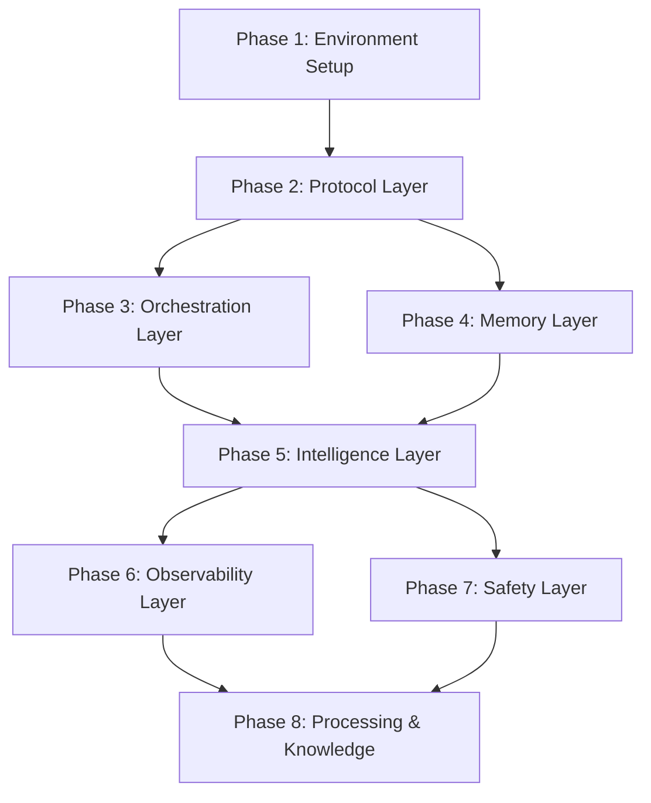

# Implementation Roadmap 2026

## Multi-Phase SDK Integration Plan

This roadmap defines the complete implementation strategy for integrating all 34 retained SDKs into the Unleash platform following the post-cleanup architecture.

---

## Phase Overview



---

## Phase 1: Environment Setup & Validation

### Overview
| Attribute | Value |
|-----------|-------|
| **Phase Name** | Environment Setup & Validation |
| **Dependencies** | None (Starting Phase) |
| **Duration Estimate** | 2-4 hours |
| **Complexity Rating** | Low |
| **SDKs Involved** | None (Infrastructure only) |

### Objectives
1. Validate Python/Node environment
2. Create unified configuration files
3. Set up virtual environment
4. Configure API credentials

### File Modifications

| Action | File | Description |
|--------|------|-------------|
| CREATE | `.env.template` | Environment variable template |
| CREATE | `.env` | Local configuration (gitignored) |
| CREATE | `requirements.txt` | Unified Python dependencies |
| CREATE | `pyproject.toml` | Project-level Python config |
| MODIFY | `.gitignore` | Add .env to ignored files |

### Pre-flight Checks
```bash
# Python version check
python --version  # Must be >= 3.11

# Node version check  
node --version    # Must be >= 18

# uv/pip availability
uv --version || pip --version

# Required directories
ls -la sdks/ stack/ core/ platform/
```

### Testing Checkpoint
```bash
# Verify environment
python -c "import sys; assert sys.version_info >= (3, 11)"
node -e "console.log(process.version)"
test -f .env && echo "ENV OK" || echo "ENV MISSING"
```

### Rollback Procedure
```bash
# Remove created files
rm -f .env .env.template requirements.txt pyproject.toml
git checkout .gitignore
```

### Success Metrics
- [ ] Python 3.11+ installed and accessible
- [ ] Node 18+ installed and accessible
- [ ] uv or pip available for package management
- [ ] `.env` file created with required variables
- [ ] All directories exist and are accessible

---

## Phase 2: Protocol Layer (Layer 0)

### Overview
| Attribute | Value |
|-----------|-------|
| **Phase Name** | Protocol Layer Setup |
| **Dependencies** | Phase 1 |
| **Duration Estimate** | 4-6 hours |
| **Complexity Rating** | Medium |
| **SDKs Involved** | mcp-python-sdk, fastmcp, litellm, anthropic, openai-sdk |

### Objectives
1. Install Protocol layer SDKs
2. Configure MCP server infrastructure
3. Set up LiteLLM gateway
4. Validate provider connections

### File Modifications

| Action | File | Description |
|--------|------|-------------|
| CREATE | `platform/.mcp.json` | MCP server configuration |
| CREATE | `platform/config/litellm_config.yaml` | LiteLLM gateway config |
| MODIFY | `requirements.txt` | Add protocol dependencies |
| CREATE | `scripts/validate_protocol.py` | Protocol validation script |

### Installation Commands
```bash
# Install Protocol SDKs
uv pip install mcp anthropic openai litellm

# Install fastmcp
uv pip install fastmcp

# Verify installations
python -c "import mcp; print('MCP OK')"
python -c "import anthropic; print('Anthropic OK')"
python -c "import openai; print('OpenAI OK')"
python -c "import litellm; print('LiteLLM OK')"
```

### Integration Points
- MCP: `platform/.mcp.json` → Claude Code integration
- LiteLLM: `platform/config/litellm_config.yaml` → Provider gateway
- Anthropic/OpenAI: API key validation

### Testing Checkpoint
```bash
# Run protocol validation
python scripts/validate_protocol.py

# Expected output:
# ✓ MCP SDK loaded
# ✓ Anthropic client initialized
# ✓ OpenAI client initialized
# ✓ LiteLLM gateway responding
```

### Rollback Procedure
```bash
uv pip uninstall mcp anthropic openai litellm fastmcp
rm -f platform/.mcp.json platform/config/litellm_config.yaml
rm -f scripts/validate_protocol.py
```

### Success Metrics
- [ ] All 5 Protocol SDKs installed
- [ ] MCP server configuration valid
- [ ] LiteLLM responds to test request
- [ ] Provider API keys validated

---

## Phase 3: Orchestration Layer (Layer 1)

### Overview
| Attribute | Value |
|-----------|-------|
| **Phase Name** | Orchestration Layer Setup |
| **Dependencies** | Phase 2 |
| **Duration Estimate** | 6-8 hours |
| **Complexity Rating** | High |
| **SDKs Involved** | temporal-python, langgraph, claude-flow, crewai, autogen |

### Objectives
1. Install Orchestration SDKs
2. Configure Temporal workers
3. Set up LangGraph state machines
4. Integrate claude-flow MCP patterns
5. Configure multi-agent frameworks

### File Modifications

| Action | File | Description |
|--------|------|-------------|
| CREATE | `platform/config/temporal_config.yaml` | Temporal worker config |
| CREATE | `core/workflows/` | LangGraph workflow definitions |
| MODIFY | `core/orchestrator.py` | Add orchestration imports |
| CREATE | `scripts/validate_orchestration.py` | Orchestration tests |

### Installation Commands
```bash
# Install Orchestration SDKs
uv pip install temporalio langgraph crewai pyautogen

# Clone claude-flow if needed (already in sdks/)
# Configure from sdks/claude-flow/

# Verify installations
python -c "import temporalio; print('Temporal OK')"
python -c "import langgraph; print('LangGraph OK')"
python -c "from crewai import Agent; print('CrewAI OK')"
python -c "import autogen; print('AutoGen OK')"
```

### Integration Points
- Temporal: Worker processes, workflow definitions
- LangGraph: State machines in `core/workflows/`
- CrewAI: Agent configurations
- AutoGen: Multi-agent conversations

### Testing Checkpoint
```bash
# Run orchestration validation
python scripts/validate_orchestration.py

# Expected:
# ✓ Temporal client connected
# ✓ LangGraph workflow compiled
# ✓ CrewAI agent created
# ✓ AutoGen conversation initialized
```

### Rollback Procedure
```bash
uv pip uninstall temporalio langgraph crewai pyautogen
rm -rf core/workflows/
rm -f platform/config/temporal_config.yaml
git checkout core/orchestrator.py
```

### Success Metrics
- [ ] Temporal worker starts successfully
- [ ] LangGraph state machine compiles
- [ ] CrewAI agent responds to task
- [ ] AutoGen multi-agent conversation works

---

## Phase 4: Memory Layer (Layer 2)

### Overview
| Attribute | Value |
|-----------|-------|
| **Phase Name** | Memory Layer Setup |
| **Dependencies** | Phase 2 |
| **Duration Estimate** | 4-6 hours |
| **Complexity Rating** | Medium |
| **SDKs Involved** | letta, zep, mem0 |

### Objectives
1. Deploy Letta server
2. Configure Zep session memory
3. Set up Mem0 persistence

### File Modifications

| Action | File | Description |
|--------|------|-------------|
| CREATE | `platform/config/letta_config.yaml` | Letta server config |
| CREATE | `platform/config/memory_config.yaml` | Unified memory config |
| CREATE | `core/memory/` | Memory integration code |
| CREATE | `scripts/validate_memory.py` | Memory validation |

### Installation Commands
```bash
# Install Memory SDKs
uv pip install letta zep-python mem0ai

# Start Letta server (if local)
# letta server --port 8500

# Verify installations
python -c "import letta; print('Letta OK')"
python -c "from zep_python import ZepClient; print('Zep OK')"
python -c "from mem0 import Memory; print('Mem0 OK')"
```

### Integration Points
- Letta: `http://localhost:8500` for agent memory
- Zep: Session management and retrieval
- Mem0: User/session memory persistence

### Testing Checkpoint
```bash
python scripts/validate_memory.py

# Expected:
# ✓ Letta server responding
# ✓ Zep client connected
# ✓ Mem0 memory initialized
# ✓ Memory persistence test passed
```

### Rollback Procedure
```bash
uv pip uninstall letta zep-python mem0ai
rm -rf core/memory/
rm -f platform/config/letta_config.yaml platform/config/memory_config.yaml
```

### Success Metrics
- [ ] Letta server accessible at configured URL
- [ ] Zep session created and retrieved
- [ ] Mem0 stores and retrieves test memory
- [ ] Cross-session memory persistence verified

---

## Phase 5: Intelligence Layer (Layers 3-4)

### Overview
| Attribute | Value |
|-----------|-------|
| **Phase Name** | Intelligence Layer Setup |
| **Dependencies** | Phase 3, Phase 4 |
| **Duration Estimate** | 6-8 hours |
| **Complexity Rating** | High |
| **SDKs Involved** | instructor, baml, outlines, pydantic-ai, dspy, serena |

### Objectives
1. Configure structured output with Instructor/BAML
2. Set up Outlines for constrained generation
3. Integrate Pydantic-AI for type-safe outputs
4. Configure DSPy prompt optimization
5. Set up Serena code analysis

### File Modifications

| Action | File | Description |
|--------|------|-------------|
| CREATE | `core/structured/` | Structured output handlers |
| CREATE | `core/reasoning/` | DSPy/reasoning modules |
| CREATE | `.serena/project.yml` | Serena project config |
| CREATE | `platform/config/intelligence_config.yaml` | Intelligence layer config |
| CREATE | `scripts/validate_intelligence.py` | Validation script |

### Installation Commands
```bash
# Install Structured Output SDKs
uv pip install instructor baml outlines pydantic-ai

# Install Reasoning SDKs
uv pip install dspy-ai

# Serena (already in sdks/serena/)
uv pip install -e sdks/serena/

# Verify
python -c "import instructor; print('Instructor OK')"
python -c "import outlines; print('Outlines OK')"
python -c "import dspy; print('DSPy OK')"
```

### Integration Points
- Instructor: OpenAI/Anthropic structured outputs
- BAML: Type-safe LLM interactions
- Outlines: JSON schema constrained generation
- DSPy: Prompt optimization pipeline
- Serena: Code understanding and analysis

### Testing Checkpoint
```bash
python scripts/validate_intelligence.py

# Expected:
# ✓ Instructor structured output generated
# ✓ BAML type validation passed
# ✓ Outlines constrained generation works
# ✓ DSPy module compiled
# ✓ Serena code analysis available
```

### Rollback Procedure
```bash
uv pip uninstall instructor baml outlines pydantic-ai dspy-ai
rm -rf core/structured/ core/reasoning/
rm -f platform/config/intelligence_config.yaml
```

### Success Metrics
- [ ] Instructor extracts structured data from LLM
- [ ] BAML validates type-safe outputs
- [ ] Outlines generates JSON conforming to schema
- [ ] DSPy optimizes sample prompt
- [ ] Serena analyzes code snippet

---

## Phase 6: Observability Layer (Layer 5)

### Overview
| Attribute | Value |
|-----------|-------|
| **Phase Name** | Observability Layer Setup |
| **Dependencies** | Phase 5 |
| **Duration Estimate** | 4-6 hours |
| **Complexity Rating** | Medium |
| **SDKs Involved** | langfuse, opik, arize-phoenix, deepeval, ragas, promptfoo |

### Objectives
1. Configure Langfuse tracing
2. Set up Opik agent monitoring
3. Deploy Arize-Phoenix ML ops
4. Integrate DeepEval testing
5. Configure Ragas evaluation
6. Set up Promptfoo prompt testing

### File Modifications

| Action | File | Description |
|--------|------|-------------|
| CREATE | `platform/config/observability_config.yaml` | Observability config |
| CREATE | `core/observability/` | Tracing/monitoring code |
| CREATE | `tests/evals/` | Evaluation test suites |
| CREATE | `scripts/validate_observability.py` | Validation script |

### Installation Commands
```bash
# Install Observability SDKs
uv pip install langfuse opik arize-phoenix deepeval ragas

# Install promptfoo (Node-based)
npm install -g promptfoo

# Verify
python -c "import langfuse; print('Langfuse OK')"
python -c "import opik; print('Opik OK')"
python -c "import phoenix; print('Phoenix OK')"
python -c "import deepeval; print('DeepEval OK')"
python -c "import ragas; print('Ragas OK')"
promptfoo --version
```

### Integration Points
- Langfuse: Cloud tracing dashboard
- Opik: Local agent monitoring
- Arize-Phoenix: ML experiment tracking
- DeepEval: Unit testing for LLMs
- Ragas: RAG evaluation metrics
- Promptfoo: Prompt regression testing

### Testing Checkpoint
```bash
python scripts/validate_observability.py

# Expected:
# ✓ Langfuse trace created
# ✓ Opik monitoring active
# ✓ Phoenix dashboard accessible
# ✓ DeepEval test passed
# ✓ Ragas metrics computed
# ✓ Promptfoo evaluation complete
```

### Rollback Procedure
```bash
uv pip uninstall langfuse opik arize-phoenix deepeval ragas
npm uninstall -g promptfoo
rm -rf core/observability/ tests/evals/
```

### Success Metrics
- [ ] Traces visible in Langfuse dashboard
- [ ] Opik captures agent interactions
- [ ] Phoenix tracks experiments
- [ ] DeepEval tests pass
- [ ] Ragas computes evaluation scores
- [ ] Promptfoo runs prompt suite

---

## Phase 7: Safety Layer (Layer 6)

### Overview
| Attribute | Value |
|-----------|-------|
| **Phase Name** | Safety Layer Setup |
| **Dependencies** | Phase 5 |
| **Duration Estimate** | 4-6 hours |
| **Complexity Rating** | High |
| **SDKs Involved** | guardrails-ai, llm-guard, nemo-guardrails |

### Objectives
1. Configure NeMo Guardrails
2. Set up LLM Guard scanning
3. Integrate Guardrails-AI validation

### File Modifications

| Action | File | Description |
|--------|------|-------------|
| CREATE | `platform/config/safety_config.yaml` | Safety layer config |
| CREATE | `core/safety/` | Guardrails integration |
| CREATE | `core/safety/rails/` | NeMo rail definitions |
| CREATE | `scripts/validate_safety.py` | Safety validation |

### Installation Commands
```bash
# Install Safety SDKs
uv pip install guardrails-ai llm-guard nemoguardrails

# Verify
python -c "import guardrails; print('Guardrails-AI OK')"
python -c "import llm_guard; print('LLM Guard OK')"
python -c "import nemoguardrails; print('NeMo Guardrails OK')"
```

### Integration Points
- NeMo Guardrails: Colang rail definitions
- LLM Guard: Input/output scanning
- Guardrails-AI: Output validation

### Testing Checkpoint
```bash
python scripts/validate_safety.py

# Expected:
# ✓ NeMo rails loaded
# ✓ LLM Guard scan completed
# ✓ Guardrails-AI validation passed
# ✓ Jailbreak detection working
# ✓ PII detection active
```

### Rollback Procedure
```bash
uv pip uninstall guardrails-ai llm-guard nemoguardrails
rm -rf core/safety/
rm -f platform/config/safety_config.yaml
```

### Success Metrics
- [ ] NeMo Guardrails blocks harmful prompts
- [ ] LLM Guard detects PII
- [ ] Guardrails-AI validates output format
- [ ] Jailbreak attempts blocked
- [ ] Safety audit log generated

---

## Phase 8: Processing & Knowledge (Layers 7-8)

### Overview
| Attribute | Value |
|-----------|-------|
| **Phase Name** | Processing & Knowledge Layer |
| **Dependencies** | Phase 6, Phase 7 |
| **Duration Estimate** | 6-8 hours |
| **Complexity Rating** | High |
| **SDKs Involved** | aider, ast-grep, crawl4ai, firecrawl, graphrag, pyribs |

### Objectives
1. Configure Aider pair programming
2. Set up ast-grep code patterns
3. Deploy Crawl4AI/Firecrawl for web scraping
4. Configure GraphRAG knowledge base
5. Set up PyRibs for quality-diversity

### File Modifications

| Action | File | Description |
|--------|------|-------------|
| CREATE | `platform/config/processing_config.yaml` | Processing config |
| CREATE | `core/processing/` | Code processing modules |
| CREATE | `core/knowledge/` | Knowledge graph code |
| CREATE | `scripts/validate_processing.py` | Validation script |

### Installation Commands
```bash
# Install Processing SDKs
uv pip install aider-chat crawl4ai

# ast-grep (Rust-based CLI)
cargo install ast-grep

# Firecrawl (external service or self-hosted)
# Configure API key: FIRECRAWL_API_KEY

# GraphRAG
uv pip install graphrag

# PyRibs
uv pip install ribs

# Verify
python -c "import aider; print('Aider OK')"
python -c "import crawl4ai; print('Crawl4AI OK')"
python -c "import graphrag; print('GraphRAG OK')"
python -c "import ribs; print('PyRibs OK')"
```

### Integration Points
- Aider: Git-aware code editing
- ast-grep: Code pattern matching
- Crawl4AI/Firecrawl: Web content extraction
- GraphRAG: Knowledge graph queries
- PyRibs: Quality-diversity optimization

### Testing Checkpoint
```bash
python scripts/validate_processing.py

# Expected:
# ✓ Aider initialized
# ✓ ast-grep patterns loaded
# ✓ Crawl4AI browser ready
# ✓ Firecrawl API connected
# ✓ GraphRAG knowledge base created
# ✓ PyRibs archive initialized
```

### Rollback Procedure
```bash
uv pip uninstall aider-chat crawl4ai graphrag ribs
cargo uninstall ast-grep
rm -rf core/processing/ core/knowledge/
rm -f platform/config/processing_config.yaml
```

### Success Metrics
- [ ] Aider can edit files via chat
- [ ] ast-grep finds code patterns
- [ ] Crawl4AI extracts web content
- [ ] Firecrawl scrapes configured URLs
- [ ] GraphRAG answers knowledge queries
- [ ] PyRibs generates diverse solutions

---

## File Modification Matrix

| Phase | New Files | Modified Files | Deleted Files |
|-------|-----------|----------------|---------------|
| 1 | 4 | 1 | 0 |
| 2 | 3 | 1 | 0 |
| 3 | 3 | 1 | 0 |
| 4 | 4 | 0 | 0 |
| 5 | 4 | 0 | 0 |
| 6 | 4 | 0 | 0 |
| 7 | 4 | 0 | 0 |
| 8 | 4 | 0 | 0 |
| **Total** | **30** | **3** | **0** |

---

## Testing Checkpoints Summary

| Phase | Test Command | Expected Output |
|-------|--------------|-----------------|
| 1 | `python -c "import sys; print(sys.version)"` | `3.11.x` |
| 2 | `python scripts/validate_protocol.py` | All ✓ |
| 3 | `python scripts/validate_orchestration.py` | All ✓ |
| 4 | `python scripts/validate_memory.py` | All ✓ |
| 5 | `python scripts/validate_intelligence.py` | All ✓ |
| 6 | `python scripts/validate_observability.py` | All ✓ |
| 7 | `python scripts/validate_safety.py` | All ✓ |
| 8 | `python scripts/validate_processing.py` | All ✓ |

---

## Rollback Matrix

| Phase | Rollback Command | Recovery Time |
|-------|------------------|---------------|
| 1 | `git checkout . && rm -f .env*` | < 1 min |
| 2 | See Phase 2 rollback | 5 min |
| 3 | See Phase 3 rollback | 10 min |
| 4 | See Phase 4 rollback | 5 min |
| 5 | See Phase 5 rollback | 10 min |
| 6 | See Phase 6 rollback | 5 min |
| 7 | See Phase 7 rollback | 5 min |
| 8 | See Phase 8 rollback | 10 min |

---

## Complete Dependency Graph

```
Phase 1 (Environment)
    │
    ▼
Phase 2 (Protocol: MCP, LiteLLM, Anthropic, OpenAI)
    │
    ├────────────────────┐
    ▼                    ▼
Phase 3 (Orchestration)  Phase 4 (Memory)
    │                    │
    └────────┬───────────┘
             ▼
    Phase 5 (Intelligence)
             │
    ┌────────┴────────┐
    ▼                 ▼
Phase 6 (Observability)  Phase 7 (Safety)
    │                    │
    └────────┬───────────┘
             ▼
    Phase 8 (Processing & Knowledge)
             │
             ▼
     ✅ FULLY INTEGRATED
```

---

## Estimated Timeline

| Phase | Duration | Cumulative |
|-------|----------|------------|
| Phase 1 | 2-4 hours | 2-4 hours |
| Phase 2 | 4-6 hours | 6-10 hours |
| Phase 3 | 6-8 hours | 12-18 hours |
| Phase 4 | 4-6 hours | 16-24 hours |
| Phase 5 | 6-8 hours | 22-32 hours |
| Phase 6 | 4-6 hours | 26-38 hours |
| Phase 7 | 4-6 hours | 30-44 hours |
| Phase 8 | 6-8 hours | **36-52 hours** |

**Total Estimated Time: 4-7 working days**

---

## Next Steps

1. **Proceed to Phase 1** using `docs/PHASE_1_CLAUDE_CODE_PROMPT.md`
2. Complete each phase validation before moving to next
3. Update this roadmap with actual completion times
4. Document any issues encountered

---

*Roadmap Version: 1.0*
*Created: 2026-01-24*
*Last Updated: 2026-01-24*
