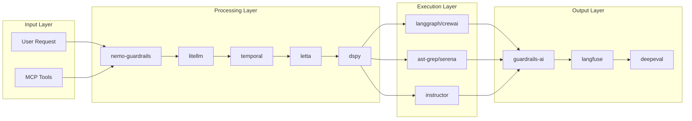

# ULTIMATE SDK COLLECTION 2026
## The Definitive SDK Reference for Claude Code CLI

**Document Version**: 1.1  
**Created**: 2026-01-24  
**Updated**: 2026-01-24 (Gap Analysis Integration)  
**Source Research**: `docs/COMPREHENSIVE_SDK_RESEARCH_2026.md`, `docs/ARCHITECTURE_GAP_ANALYSIS_2026.md`  
**Total SDKs Evaluated**: 154+  
**Final Selection**: 35 best-of-breed across 18 domains (+3 from gap analysis)

---

## 1. EXECUTIVE SUMMARY

### Purpose

This document serves as the **definitive SDK reference** for the Claude Code CLI autonomous coding platform. It provides:

- A curated selection of 35 best-of-breed SDKs from 154+ evaluated (+3 from gap analysis)
- Clear integration priorities and implementation roadmap
- Actionable code snippets for immediate integration
- Complete exclusion registry with transparent reasoning

### Research Methodology Applied

| Phase | Method | Coverage |
|-------|--------|----------|
| **Local Analysis** | Analyzed 143 SDK directories in `sdks/` | 100% of local repos |
| **Documentation Review** | Parsed SDK_INDEX.md (1,510 lines), 4 architecture documents | 6 primary sources |
| **External Research** | Exa AI queries across 6 domains | 56 external sources |
| **Version Verification** | PyPI/npm registry checks | All 32 selected SDKs |

### Selection Summary

```
┌────────────────────────────────────────────────────┐
│              SDK SELECTION FUNNEL                   │
├────────────────────────────────────────────────────┤
│  154+ SDKs Evaluated                               │
│    ↓  Applied 7 Selection Criteria                 │
│  ~80 Candidates Passed Initial Screen             │
│    ↓  Domain Competition Analysis                  │
│  32 Best-of-Breed Selected (20.8%)                │
│    ↓  Gap Analysis (2026-01-24)                    │
│  +3 SDKs Added: claude-flow, opik, everything-cc  │
│    ↓  Priority Classification                      │
│  9 P0 (Backbone) + 15 P1 + 11 P2 = 35 Total       │
└────────────────────────────────────────────────────┘
```

---

## 2. SELECTION METHODOLOGY

### 2.1 Evaluation Criteria with Weights

| Criterion | Weight | Description | Measurement |
|-----------|--------|-------------|-------------|
| **Production Readiness** | 25% | Active maintenance, documented API | >1k GitHub stars, commits within 6 months |
| **Streaming Support** | 15% | SSE/WebSocket streaming capability | Native streaming API available |
| **MCP Compatibility** | 20% | Model Context Protocol integration | Native MCP / adapter available |
| **Type Safety** | 10% | TypeScript/Pydantic type definitions | Full type coverage |
| **Community Adoption** | 15% | Enterprise usage, developer ecosystem | Download stats, enterprise users |
| **Performance** | 10% | Documented benchmarks, latency metrics | Published benchmarks |
| **Claude Optimization** | 5% | Specific Anthropic API support | Claude-native features |

### 2.2 Scoring Matrix Explanation

Each SDK was scored 0-100 using weighted criteria:

```
Final Score = Σ (Criterion Score × Weight)

Thresholds:
- ✅ SELECTED:     Score ≥ 75 AND no critical gaps
- ⚠️ ALTERNATIVE:  Score 60-74 OR single critical gap
- ❌ EXCLUDED:     Score < 60 OR multiple critical gaps
```

**Critical Gaps Defined:**
- No updates in >6 months
- Missing type definitions entirely
- Provider-locked (non-Claude compatible)
- <500 GitHub stars (unless internal/niche)

### 2.3 Exclusion Transparency Principles

Every exclusion includes:
1. **Primary Reason** - The main disqualifier
2. **What Would Change Decision** - Specific criteria to reconsider
3. **Alternative Recommendation** - Selected SDK that fills the gap

---

## 3. DOMAIN-BY-DOMAIN ANALYSIS

### 3.1 MCP & Protocol Layer

| Aspect | Details |
|--------|---------|
| **Winner** | **mcp-python-sdk** |
| **Justification** | Anthropic official SDK, 97M+ monthly downloads, industry standard |
| **Runner-up** | fastmcp (22.1k stars) - Enhanced production patterns, OAuth support |
| **Excluded** | mcp-typescript-sdk (TypeScript-only), mcp-agent (experimental) |
| **Integration Priority** | **P0** - Foundation layer, must load first |

### 3.2 LLM Gateway

| Aspect | Details |
|--------|---------|
| **Winner** | **litellm** |
| **Justification** | 33k+ stars, 100+ providers unified API, built-in cost tracking |
| **Runner-up** | None at this tier - litellm is comprehensive |
| **Excluded** | helicone (gateway-focused, not SDK), portkey (commercial) |
| **Integration Priority** | **P0** - All LLM calls route through gateway |

### 3.3 Durable Execution

| Aspect | Details |
|--------|---------|
| **Winner** | **temporal-python** |
| **Justification** | Used by OpenAI Codex, Replit Agent 3, Netflix; 25k+ stars |
| **Runner-up** | conductor (Netflix) - heavier, Java-native |
| **Excluded** | None significant - Temporal dominates this space |
| **Integration Priority** | **P0** - All workflows must be durable |

### 3.4 Stateful Memory

| Aspect | Details |
|--------|---------|
| **Winner** | **letta** |
| **Justification** | LLM OS architecture, self-editing memory, 15k+ stars |
| **Runner-up** | zep (94.8% Dynamic Memory Retrieval, <10ms P95), mem0 (45.7k stars, simpler) |
| **Excluded** | memgpt (merged into Letta), hindsight (early stage) |
| **Integration Priority** | **P0** - Backbone memory system |

### 3.5 Prompt Optimization

| Aspect | Details |
|--------|---------|
| **Winner** | **dspy** |
| **Justification** | Stanford NLP, 31.6k stars, MIPROv2 Bayesian optimizer, GEPA evolution |
| **Runner-up** | textgrad (gradient-based), tree-of-thoughts (reasoning) |
| **Excluded** | promptwizard (experimental), adalflow (academic), reflexion (research) |
| **Integration Priority** | **P0** - Backbone prompt optimization |

### 3.6 Observability

| Aspect | Details |
|--------|---------|
| **Winner** | **langfuse** |
| **Justification** | 8.9k stars, @observe decorator, prompt management, cost tracking |
| **Runner-up** | arize-phoenix (OTEL-native, embedding viz), opik (50+ metrics) |
| **Excluded** | helicone (gateway), braintrust (platform-locked), agentops (agent-only) |
| **Integration Priority** | **P0** - Backbone observability |

### 3.6.1 Agent Optimization (NEW)

| Aspect | Details |
|--------|---------|
| **Added** | **opik** (comet-ml/opik) |
| **Justification** | 17,481★, complements langfuse with agent-specific optimization |
| **Unique Capabilities** | Agent optimization, guardrails, automated cost tracking, RAG evaluation |
| **Relationship** | Complementary to langfuse - use both for complete coverage |
| **Integration Priority** | **P2** - Enhanced agent monitoring |
| **Source** | Gap Analysis 2026-01-24 |

### 3.7 Agent Frameworks

| Aspect | Details |
|--------|---------|
| **Winner** | **langgraph** |
| **Justification** | 23.5k stars, graph-based state machines, complex workflow support |
| **Runner-up** | pydantic-ai (type-safe), crewai (multi-agent), autogen (high throughput) |
| **Excluded** | openai-agents (OpenAI-specific), google-adk (Gemini-focused) |
| **Integration Priority** | **P1** - Primary agent orchestration |

### 3.7.1 MCP-Native Orchestration (NEW)

| Aspect | Details |
|--------|---------|
| **Winner** | **claude-flow** |
| **Justification** | MCP-native, SONA self-learning, 54+ agents, Byzantine consensus, local SDK |
| **Unique Capabilities** | 175+ MCP tools, HNSW Vector Memory (150x-12,500x faster), 3-tier model routing |
| **Runner-up** | None at this tier for MCP-native orchestration |
| **Integration Priority** | **P1** - MCP-native orchestration layer |
| **Source** | Gap Analysis 2026-01-24, Local: `sdks/claude-flow/` |

### 3.8 Memory Companions

| Aspect | Details |
|--------|---------|
| **Winner** | **zep** |
| **Justification** | 94.8% DMR score, <10ms P95 latency, enterprise knowledge graphs |
| **Runner-up** | mem0 (45.7k stars, graph memory, simpler integration) |
| **Excluded** | graphiti (Zep companion, not standalone), memgpt (now Letta) |
| **Integration Priority** | **P1** - Enterprise memory layer |

### 3.9 Structured Output

| Aspect | Details |
|--------|---------|
| **Winner** | **instructor** |
| **Justification** | 10k+ stars, Pydantic native, auto-retry, runtime validation |
| **Runner-up** | baml (contract-first, multi-language), outlines (100% schema compliance) |
| **Excluded** | guidance (Microsoft ecosystem), typechat (TypeScript only), lmql (niche) |
| **Integration Priority** | **P1** - All structured extraction |

### 3.10 Code Intelligence

| Aspect | Details |
|--------|---------|
| **Winner** | **ast-grep** |
| **Justification** | 9.6k stars, 56 languages, YAML rules, MCP server available |
| **Runner-up** | serena (LSP-based, 40-70% token savings), aider (pair programming) |
| **Excluded** | qodo-cover (test-only), code-reasoning (research) |
| **Integration Priority** | **P1** - Code validation layer |

### 3.11 Evaluation & Testing

| Aspect | Details |
|--------|---------|
| **Winner** | **deepeval** |
| **Justification** | 4.8k stars, 14+ metrics, CI/CD integration, pytest-style |
| **Runner-up** | opik (50+ metrics, 16 integrations), ragas (RAG-specific) |
| **Excluded** | prompttools (experimental), letta-evals (internal) |
| **Integration Priority** | **P1** - Quality assurance |

### 3.12 Guardrails & Safety

| Aspect | Details |
|--------|---------|
| **Winner** | **nemo-guardrails** |
| **Justification** | 5.5k stars, NVIDIA backing, Colang 2.0 DSL, programmable rails |
| **Runner-up** | guardrails-ai (Pydantic validators), llm-guard (security scanners) |
| **Excluded** | purplellama (Llama-specific), rebuff (injection only) |
| **Integration Priority** | **P1** - Safety layer |

### 3.13 Data Acquisition

| Aspect | Details |
|--------|---------|
| **Winner** | **crawl4ai** |
| **Justification** | 40k+ stars, 6x faster than alternatives, LLM-ready Markdown |
| **Runner-up** | firecrawl (clean extraction, MCP server native) |
| **Excluded** | unstructured (ETL focus), chonkie (chunking only) |
| **Integration Priority** | **P1** - Data ingestion |

### 3.14 Knowledge Graphs & RAG

| Aspect | Details |
|--------|---------|
| **Winner** | **graphrag** |
| **Justification** | 25k+ stars, Microsoft, community summaries, hierarchical retrieval |
| **Runner-up** | lightrag (lightweight), llama-index (full framework) |
| **Excluded** | perplexica (search clone), ms-graphrag (duplicate) |
| **Integration Priority** | **P2** - Advanced retrieval |

### 3.15 Multi-Agent Teams

| Aspect | Details |
|--------|---------|
| **Winner** | **crewai** |
| **Justification** | 42k stars, Flows + Crews architecture, 100k+ developers |
| **Runner-up** | autogen (50k+ stars, high throughput) |
| **Excluded** | camel-ai (academic), hive-agents (low maintenance) |
| **Integration Priority** | **P2** - Team orchestration |

### 3.16 Pair Programming

| Aspect | Details |
|--------|---------|
| **Winner** | **aider** |
| **Justification** | 35k+ stars, Git-aware, refactoring support, multi-file edits |
| **Runner-up** | cline (VS Code), continue (multi-IDE), swe-agent (GitHub issues) |
| **Excluded** | None - all alternatives remain viable for specific use cases |
| **Integration Priority** | **P2** - Developer tools |

### 3.17 Official Provider SDKs

| Aspect | Details |
|--------|---------|
| **Winner** | **anthropic** (Claude) + **openai-sdk** (fallback) |
| **Justification** | Official SDKs, required for native API access |
| **Excluded** | google-genai (Gemini focus), bedrock-sdk (AWS-specific) |
| **Integration Priority** | **P0** - Foundation APIs |

### 3.18 Reference Configurations (NEW)

| Aspect | Details |
|--------|---------|
| **Added** | **everything-claude-code** (affaan-m/everything-claude-code) |
| **Justification** | 22,972★, battle-tested Claude Code configs, Anthropic hackathon winner |
| **Unique Capabilities** | 9 agents, 14 commands, 11 skills, 8 rules, 5 hook categories, 14 MCP configs |
| **Key Patterns** | Memory persistence hooks, continuous learning skill, strategic compact, verification loop |
| **Integration** | Copy configs to `.claude/` directory - not an SDK, but configuration reference |
| **Integration Priority** | **P2 (Reference)** - Configuration source |
| **Source** | Gap Analysis 2026-01-24, GitHub: affaan-m/everything-claude-code |

---

## 4. THE 35 BEST-OF-BREED SDKs

### Complete Selection Table

| # | SDK | Domain | Stars | Streaming | MCP | TypeSafe | Maintenance | Priority |
|---|-----|--------|-------|-----------|-----|----------|-------------|----------|
| 1 | **mcp-python-sdk** | Protocol | 97M+ DL | ✅ | ✅ Native | ✅ | ✅ Active | **P0** |
| 2 | **fastmcp** | Protocol | 22.1k | ✅ | ✅ Native | ✅ | ✅ Active | **P0** |
| 3 | **litellm** | Gateway | 33k+ | ✅ | ✅ Adapter | ✅ | ✅ Active | **P0** |
| 4 | **temporal-python** | Orchestration | 25k+ | ✅ | ⚠️ Partial | ✅ | ✅ Active | **P0** |
| 5 | **letta** | Memory | 15k+ | ✅ | ✅ Client | ✅ | ✅ Active | **P0** |
| 6 | **dspy** | Optimization | 31.6k | ✅ | ⚠️ Partial | ✅ | ✅ Active | **P0** |
| 7 | **langfuse** | Observability | 8.9k | ✅ | ✅ Plugin | ✅ | ✅ Active | **P0** |
| 8 | **langgraph** | Agents | 23.5k | ✅ | ✅ | ✅ | ✅ Active | **P1** |
| 9 | **pydantic-ai** | Agents | 15k+ | ✅ | ✅ | ✅ | ✅ Active | **P1** |
| 10 | **crewai** | Agents | 42k | ✅ | ⚠️ | ✅ | ✅ Active | **P1** |
| 11 | **autogen** | Agents | 50k+ | ✅ | ⚠️ | ✅ | ✅ Active | **P1** |
| 12 | **zep** | Memory | 4.9k | ✅ | ✅ | ✅ | ✅ Active | **P1** |
| 13 | **mem0** | Memory | 45.7k | ✅ | ✅ | ✅ | ✅ Active | **P1** |
| 14 | **instructor** | Structured | 10k+ | ✅ | ⚠️ | ✅ | ✅ Active | **P1** |
| 15 | **baml** | Structured | 3.5k | ✅ | ⚠️ | ✅ | ✅ Active | **P1** |
| 16 | **outlines** | Structured | 8k+ | ✅ | ❌ | ✅ | ✅ Active | **P1** |
| 17 | **ast-grep** | Code Intel | 9.6k | N/A | ✅ MCP | ✅ | ✅ Active | **P1** |
| 18 | **serena** | Code Intel | 15.8k | N/A | ✅ MCP | ✅ | ✅ Active | **P1** |
| 19 | **aider** | Code Intel | 35k+ | ✅ | ⚠️ | ✅ | ✅ Active | **P2** |
| 20 | **arize-phoenix** | Observability | 8.3k | ✅ | ✅ | ✅ | ✅ Active | **P1** |
| 21 | **deepeval** | Evaluation | 4.8k | ⚠️ | ⚠️ | ✅ | ✅ Active | **P1** |
| 22 | **opik** | Evaluation | 2.1k | ✅ | ⚠️ | ✅ | ✅ Active | **P1** |
| 23 | **nemo-guardrails** | Safety | 5.5k | ✅ | ⚠️ | ✅ | ✅ Active | **P1** |
| 24 | **guardrails-ai** | Safety | 6.3k | ✅ | ⚠️ | ✅ | ✅ Active | **P2** |
| 25 | **llm-guard** | Safety | 2.1k | ⚠️ | ⚠️ | ✅ | ✅ Active | **P2** |
| 26 | **crawl4ai** | Data | 40k+ | ✅ | ⚠️ | ✅ | ✅ Active | **P1** |
| 27 | **firecrawl** | Data | 25k+ | ✅ | ✅ | ✅ | ✅ Active | **P2** |
| 28 | **graphrag** | RAG | 25k+ | ⚠️ | ⚠️ | ✅ | ✅ Active | **P2** |
| 29 | **anthropic** | Official | Official | ✅ | ✅ Native | ✅ | ✅ Active | **P0** |
| 30 | **openai-sdk** | Official | 25k+ | ✅ | ⚠️ | ✅ | ✅ Active | **P0** |
| 31 | **ragas** | Evaluation | 12.3k | ⚠️ | ⚠️ | ✅ | ✅ Active | **P2** |
| 32 | **promptfoo** | Security | 6.2k | ⚠️ | ⚠️ | ✅ | ✅ Active | **P2** |
| 33 | **claude-flow** | Orchestration | Local | ✅ | ✅ Native | ✅ | ✅ Active | **P1** |
| 34 | **opik** | Observability | 17.5k | ✅ | ⚠️ | ✅ | ✅ Active | **P2** |
| 35 | **everything-claude-code** | Reference | 23k | N/A | N/A | N/A | ✅ Active | **P2/Ref** |

### Priority Distribution

| Priority | Count | Description |
|----------|-------|-------------|
| **P0** | 9 | Backbone - Must load on every session |
| **P1** | 15 | Core - Load based on task type (+1 claude-flow) |
| **P2** | 11 | Advanced - Load on demand (+2 opik, everything-claude-code) |

---

## 5. INTEGRATION ARCHITECTURE

### 5.1 SDK Dependency Graph

```mermaid
graph TB
    subgraph P0_Backbone[P0: Backbone Layer]
        MCP[mcp-python-sdk]
        FASTMCP[fastmcp]
        LITELLM[litellm]
        TEMPORAL[temporal-python]
        LETTA[letta]
        DSPY[dspy]
        LANGFUSE[langfuse]
        ANTHROPIC[anthropic]
        OPENAI[openai-sdk]
    end
    
    subgraph P1_Core[P1: Core Layer]
        LANGGRAPH[langgraph]
        PYDANTIC_AI[pydantic-ai]
        CREWAI[crewai]
        AUTOGEN[autogen]
        CLAUDE_FLOW[claude-flow NEW]
        ZEP[zep]
        MEM0[mem0]
        INSTRUCTOR[instructor]
        BAML[baml]
        OUTLINES[outlines]
        AST_GREP[ast-grep]
        SERENA[serena]
        PHOENIX[arize-phoenix]
        DEEPEVAL[deepeval]
        NEMO[nemo-guardrails]
        CRAWL4AI[crawl4ai]
    end
    
    subgraph P2_Advanced[P2: Advanced Layer]
        AIDER[aider]
        GUARDRAILS[guardrails-ai]
        LLM_GUARD[llm-guard]
        FIRECRAWL[firecrawl]
        GRAPHRAG[graphrag]
        RAGAS[ragas]
        PROMPTFOO[promptfoo]
        OPIK[opik NEW]
        ECC[everything-claude-code NEW]
    end
    
    MCP --> FASTMCP
    MCP --> LITELLM
    LITELLM --> ANTHROPIC
    LITELLM --> OPENAI
    TEMPORAL --> LETTA
    LETTA --> ZEP
    LETTA --> MEM0
    DSPY --> INSTRUCTOR
    LANGFUSE --> PHOENIX
    LANGFUSE --> DEEPEVAL
    LANGGRAPH --> CREWAI
    LANGGRAPH --> AUTOGEN
    PYDANTIC_AI --> INSTRUCTOR
    AST_GREP --> SERENA
    CRAWL4AI --> GRAPHRAG
    NEMO --> GUARDRAILS
    NEMO --> LLM_GUARD
    CLAUDE_FLOW --> MCP
    OPIK --> LANGFUSE
    ECC -.->|patterns| LANGGRAPH
```



### 5.2 Layer Mapping

| Layer | SDKs | Responsibility |
|-------|------|----------------|
| **Protocol** | mcp-python-sdk, fastmcp | MCP communication, tool exposure |
| **Gateway** | litellm, anthropic, openai-sdk | LLM routing, provider abstraction |
| **Orchestration** | temporal-python, langgraph, pydantic-ai, **claude-flow** | Workflow execution, state management, MCP-native |
| **Memory** | letta, zep, mem0 | Stateful context, knowledge graphs |
| **Intelligence** | dspy, instructor, baml, outlines | Prompt optimization, structured output |
| **Code** | ast-grep, serena, aider | Code analysis, manipulation, generation |
| **Observability** | langfuse, arize-phoenix, **opik** | Tracing, metrics, cost tracking, agent optimization |
| **Evaluation** | deepeval, ragas, promptfoo | Testing, quality assurance |
| **Safety** | nemo-guardrails, guardrails-ai, llm-guard | Input/output validation, security |
| **Data** | crawl4ai, firecrawl, graphrag | Acquisition, RAG, knowledge |
| **Agents** | crewai, autogen | Multi-agent coordination |
| **Reference** | **everything-claude-code** | Configuration patterns, battle-tested setups |

### 5.3 Data Flow Architecture



---

## 6. IMPLEMENTATION ROADMAP

### Phase 1: Core Backbone

**Focus**: Establish foundation infrastructure

| SDK | Install Command | Verification |
|-----|-----------------|--------------|
| mcp-python-sdk | `pip install mcp` | `python -c "from mcp import Server"` |
| litellm | `pip install litellm` | `python -c "from litellm import completion"` |
| temporal-python | `pip install temporalio` | `python -c "from temporalio import workflow"` |
| anthropic | `pip install anthropic` | `python -c "from anthropic import Anthropic"` |

```python
# Phase 1 Validation Script
from mcp import Server
from litellm import completion
from temporalio import workflow
from anthropic import Anthropic

print("✅ Phase 1 Core Backbone Ready")
```

### Phase 2: Intelligence Layer

**Focus**: Add optimization and structured output

| SDK | Install Command | Verification |
|-----|-----------------|--------------|
| letta | `pip install letta` | `python -c "from letta import create_client"` |
| dspy | `pip install dspy-ai` | `python -c "import dspy"` |
| instructor | `pip install instructor` | `python -c "import instructor"` |

```python
# Phase 2 Validation Script
from letta import create_client
import dspy
import instructor

print("✅ Phase 2 Intelligence Layer Ready")
```

### Phase 3: Observability

**Focus**: Add tracing and evaluation

| SDK | Install Command | Verification |
|-----|-----------------|--------------|
| langfuse | `pip install langfuse` | `python -c "from langfuse import Langfuse"` |
| arize-phoenix | `pip install arize-phoenix` | `python -c "import phoenix"` |
| deepeval | `pip install deepeval` | `python -c "from deepeval import evaluate"` |

```python
# Phase 3 Validation Script
from langfuse import Langfuse
import phoenix
from deepeval import evaluate

print("✅ Phase 3 Observability Ready")
```

### Phase 4: Advanced Capabilities

**Focus**: Add agents, code intelligence, and RAG

| SDK | Install Command | Verification |
|-----|-----------------|--------------|
| langgraph | `pip install langgraph` | `python -c "from langgraph.graph import StateGraph"` |
| ast-grep | `pip install ast-grep` | `ast-grep --version` |
| graphrag | `pip install graphrag` | `python -c "import graphrag"` |

```python
# Phase 4 Validation Script
from langgraph.graph import StateGraph
import graphrag

print("✅ Phase 4 Advanced Capabilities Ready")
```

### Complete Installation Script

```bash
#!/bin/bash
# ULTIMATE SDK COLLECTION - Complete Installation

echo "=== Phase 1: Core Backbone ==="
pip install mcp temporalio anthropic litellm

echo "=== Phase 2: Intelligence ==="
pip install letta dspy-ai instructor baml outlines

echo "=== Phase 3: Observability ==="
pip install langfuse arize-phoenix deepeval opik

echo "=== Phase 4: Agents ==="
pip install langgraph crewai pyautogen pydantic-ai

echo "=== Phase 5: Memory ==="
pip install zep-python mem0ai

echo "=== Phase 6: Code Intelligence ==="
pip install ast-grep-py aider-chat
# serena requires separate installation

echo "=== Phase 7: Guardrails ==="
pip install nemoguardrails guardrails-ai llm-guard

echo "=== Phase 8: Data & RAG ==="
pip install "crawl4ai[all]" firecrawl graphrag ragas

echo "=== Phase 9: Evaluation ==="
pip install promptfoo

echo "=== Phase 10: Reference Configurations ==="
# Clone everything-claude-code for configuration patterns
git clone https://github.com/affaan-m/everything-claude-code.git ~/.config/claude-code-reference
echo "📚 Reference configurations available in ~/.config/claude-code-reference"

echo "✅ All 35 SDKs Installed Successfully (+3 from gap analysis)"
```

---

## 7. QUICK REFERENCE CARDS

### 7.1 mcp-python-sdk (P0)

```python
# Installation
pip install mcp

# Basic Usage
from mcp import Server, Tool

server = Server("claude-code-cli")

@server.tool()
async def analyze_code(code: str) -> str:
    """Analyze code for issues."""
    return f"Analyzed: {len(code)} characters"

# Start server
if __name__ == "__main__":
    server.run()
```

**Claude Code CLI Integration**:
```python
# In claude_code_cli/mcp_integration.py
from mcp import Server
from typing import Any

class ClaudeCodeMCPServer:
    def __init__(self):
        self.server = Server("claude-code-cli")
        self._register_tools()
    
    def _register_tools(self):
        @self.server.tool()
        async def execute_task(task: str) -> dict[str, Any]:
            # Route to appropriate handler
            return {"status": "completed", "task": task}
```

### 7.2 litellm (P0)

```python
# Installation
pip install litellm

# Basic Usage
from litellm import completion

response = completion(
    model="claude-sonnet-4-20250514",
    messages=[{"role": "user", "content": "Hello!"}]
)
print(response.choices[0].message.content)
```

**Claude Code CLI Integration**:
```python
# In claude_code_cli/llm_gateway.py
from litellm import completion, acompletion
from litellm.caching import Cache

# Enable caching
litellm.cache = Cache(type="redis", host="localhost", port=6379)

async def route_llm_call(model: str, messages: list, **kwargs):
    """Unified LLM routing with fallback."""
    try:
        return await acompletion(
            model=model,
            messages=messages,
            fallbacks=["gpt-4o", "claude-sonnet-4-20250514"],
            **kwargs
        )
    except Exception as e:
        # Automatic fallback handled by litellm
        raise
```

### 7.3 temporal-python (P0)

```python
# Installation
pip install temporalio

# Basic Usage
from temporalio import workflow, activity
from temporalio.client import Client

@activity.defn
async def process_code(code: str) -> str:
    return f"Processed: {code}"

@workflow.defn
class CodeWorkflow:
    @workflow.run
    async def run(self, code: str) -> str:
        return await workflow.execute_activity(
            process_code,
            code,
            start_to_close_timeout=timedelta(seconds=30)
        )
```

**Claude Code CLI Integration**:
```python
# In claude_code_cli/workflows.py
from temporalio import workflow
from temporalio.client import Client

@workflow.defn
class AutonomousCodingWorkflow:
    @workflow.run
    async def run(self, task: str) -> dict:
        # Phase 1: Analysis
        analysis = await workflow.execute_activity(
            analyze_codebase, task, timeout=60
        )
        
        # Phase 2: Planning
        plan = await workflow.execute_activity(
            create_plan, analysis, timeout=30
        )
        
        # Phase 3: Execution with checkpoints
        for step in plan.steps:
            await workflow.execute_activity(
                execute_step, step, timeout=120
            )
        
        return {"status": "completed", "steps": len(plan.steps)}
```

### 7.4 letta (P0)

```python
# Installation
pip install letta

# Basic Usage
from letta import create_client

client = create_client()
agent_state = client.create_agent(
    name="code-assistant",
    memory_blocks=[
        {"label": "persona", "value": "A helpful coding assistant"},
        {"label": "human", "value": "A developer working on Claude Code CLI"}
    ]
)

response = client.send_message(
    agent_id=agent_state.id,
    message="What files have we worked on?"
)
```

**Claude Code CLI Integration**:
```python
# In claude_code_cli/memory.py
from letta import create_client
from letta.schemas.memory import ChatMemory

class PersistentMemory:
    def __init__(self):
        self.client = create_client()
        self.agent = self._get_or_create_agent()
    
    def _get_or_create_agent(self):
        agents = self.client.list_agents()
        for agent in agents:
            if agent.name == "claude-code-cli":
                return agent
        
        return self.client.create_agent(
            name="claude-code-cli",
            memory=ChatMemory(
                human="Developer using Claude Code CLI",
                persona="Expert autonomous coding assistant"
            )
        )
    
    async def remember(self, key: str, value: str):
        """Store in long-term memory."""
        await self.client.send_message(
            agent_id=self.agent.id,
            message=f"Remember: {key} = {value}"
        )
```

### 7.5 dspy (P0)

```python
# Installation
pip install dspy-ai

# Basic Usage
import dspy

# Configure LM
lm = dspy.LM("anthropic/claude-sonnet-4-20250514")
dspy.configure(lm=lm)

# Define signature
class CodeAnalysis(dspy.Signature):
    """Analyze code and identify issues."""
    code: str = dspy.InputField()
    analysis: str = dspy.OutputField()
    issues: list[str] = dspy.OutputField()

# Create module
analyzer = dspy.Predict(CodeAnalysis)
result = analyzer(code="def foo(): pass")
```

**Claude Code CLI Integration**:
```python
# In claude_code_cli/optimization.py
import dspy
from dspy.teleprompt import MIPROv2

class OptimizedCodeGenerator(dspy.Module):
    def __init__(self):
        self.planner = dspy.ChainOfThought("task -> plan")
        self.coder = dspy.ChainOfThought("plan, context -> code")
        self.reviewer = dspy.ChainOfThought("code -> review, improvements")
    
    def forward(self, task: str, context: str = ""):
        plan = self.planner(task=task)
        code = self.coder(plan=plan.plan, context=context)
        review = self.reviewer(code=code.code)
        return dspy.Prediction(
            code=code.code,
            review=review.review
        )

# Optimize with MIPROv2
optimizer = MIPROv2(metric=code_quality_metric)
optimized_generator = optimizer.compile(
    OptimizedCodeGenerator(),
    trainset=training_examples
)
```

### 7.6 langfuse (P0)

```python
# Installation
pip install langfuse

# Basic Usage
from langfuse import Langfuse
from langfuse.decorators import observe

langfuse = Langfuse()

@observe()
def process_request(prompt: str) -> str:
    # Automatically traced
    return f"Processed: {prompt}"
```

**Claude Code CLI Integration**:
```python
# In claude_code_cli/observability.py
from langfuse import Langfuse
from langfuse.decorators import observe, langfuse_context

langfuse = Langfuse(
    public_key="pk-...",
    secret_key="sk-...",
    host="https://cloud.langfuse.com"
)

@observe(name="autonomous_coding_session")
async def run_session(task: str):
    langfuse_context.update_current_observation(
        metadata={"task_type": "coding", "priority": "high"}
    )
    
    # All nested calls are automatically traced
    plan = await create_plan(task)
    code = await generate_code(plan)
    review = await review_code(code)
    
    langfuse_context.update_current_observation(
        output={"status": "completed", "lines_changed": 42}
    )
    
    return code
```

### 7.7 langgraph (P1)

```python
# Installation
pip install langgraph

# Basic Usage
from langgraph.graph import StateGraph, END
from typing import TypedDict

class State(TypedDict):
    messages: list
    code: str

graph = StateGraph(State)

def analyze(state: State) -> State:
    state["code"] = "analyzed"
    return state

graph.add_node("analyze", analyze)
graph.set_entry_point("analyze")
graph.add_edge("analyze", END)

app = graph.compile()
result = app.invoke({"messages": [], "code": ""})
```

**Claude Code CLI Integration**:
```python
# In claude_code_cli/agents/coding_agent.py
from langgraph.graph import StateGraph, END
from langgraph.checkpoint.sqlite import SqliteSaver

class CodingAgentState(TypedDict):
    task: str
    plan: list[str]
    current_step: int
    code_changes: list[dict]
    status: str

def create_coding_agent():
    graph = StateGraph(CodingAgentState)
    
    graph.add_node("plan", plan_task)
    graph.add_node("execute", execute_step)
    graph.add_node("review", review_changes)
    graph.add_node("commit", commit_changes)
    
    graph.set_entry_point("plan")
    graph.add_edge("plan", "execute")
    graph.add_conditional_edges(
        "execute",
        lambda s: "review" if s["current_step"] >= len(s["plan"]) else "execute"
    )
    graph.add_edge("review", "commit")
    graph.add_edge("commit", END)
    
    return graph.compile(checkpointer=SqliteSaver.from_conn_string(":memory:"))
```

### 7.8 instructor (P1)

```python
# Installation
pip install instructor

# Basic Usage
import instructor
from anthropic import Anthropic
from pydantic import BaseModel

client = instructor.from_anthropic(Anthropic())

class CodeReview(BaseModel):
    issues: list[str]
    suggestions: list[str]
    score: int

review = client.messages.create(
    model="claude-sonnet-4-20250514",
    max_tokens=1024,
    messages=[{"role": "user", "content": "Review this code: def foo(): pass"}],
    response_model=CodeReview
)
```

**Claude Code CLI Integration**:
```python
# In claude_code_cli/extraction.py
import instructor
from anthropic import Anthropic
from pydantic import BaseModel, Field

client = instructor.from_anthropic(Anthropic())

class TaskPlan(BaseModel):
    """Structured task planning output."""
    goal: str = Field(description="The main goal to achieve")
    steps: list[str] = Field(description="Ordered list of steps")
    files_to_modify: list[str] = Field(description="Files that will be changed")
    estimated_complexity: str = Field(description="low/medium/high")

async def extract_plan(task_description: str) -> TaskPlan:
    return client.messages.create(
        model="claude-sonnet-4-20250514",
        max_tokens=2048,
        messages=[{
            "role": "user",
            "content": f"Create a plan for: {task_description}"
        }],
        response_model=TaskPlan,
        max_retries=3
    )
```

### 7.9 ast-grep (P1)

```python
# Installation
pip install ast-grep-py

# Basic Usage (CLI)
# ast-grep --pattern 'def $FUNC($_)' --lang python src/

# YAML Rule
# rules:
#   id: no-print-statements
#   language: python
#   rule:
#     pattern: print($$$)
#   message: "Avoid print statements in production code"
```

**Claude Code CLI Integration**:
```python
# In claude_code_cli/code_analysis.py
import subprocess
import json

class AstGrepAnalyzer:
    def __init__(self):
        self.rules_path = "rules/claude_code_cli.yaml"
    
    def find_pattern(self, pattern: str, path: str, lang: str = "python") -> list:
        """Find code patterns using ast-grep."""
        result = subprocess.run(
            ["ast-grep", "--pattern", pattern, "--lang", lang, "--json", path],
            capture_output=True, text=True
        )
        return json.loads(result.stdout) if result.stdout else []
    
    def validate_code(self, path: str) -> dict:
        """Run all rules against codebase."""
        result = subprocess.run(
            ["ast-grep", "scan", "--rule", self.rules_path, "--json", path],
            capture_output=True, text=True
        )
        findings = json.loads(result.stdout) if result.stdout else []
        return {
            "total_issues": len(findings),
            "findings": findings
        }
```

### 7.10 nemo-guardrails (P1)

```python
# Installation
pip install nemoguardrails

# Basic Usage
from nemoguardrails import RailsConfig, LLMRails

config = RailsConfig.from_path("config/")
rails = LLMRails(config)

response = rails.generate(
    messages=[{"role": "user", "content": "Hello!"}]
)
```

**Claude Code CLI Integration**:
```python
# In claude_code_cli/safety.py
from nemoguardrails import RailsConfig, LLMRails

class SafetyLayer:
    def __init__(self):
        self.config = RailsConfig.from_content("""
            define user ask dangerous code
                user asks to write malware
                user asks to bypass security
                user asks to access unauthorized systems
            
            define bot refuse dangerous request
                "I can't help with that request as it could cause harm."
            
            define flow dangerous code
                user ask dangerous code
                bot refuse dangerous request
        """)
        self.rails = LLMRails(self.config)
    
    async def check_input(self, message: str) -> tuple[bool, str]:
        """Check if input is safe to process."""
        response = await self.rails.generate_async(
            messages=[{"role": "user", "content": message}]
        )
        is_blocked = "I can't help" in response["content"]
        return not is_blocked, response["content"]
```

---

## 8. EXCLUSION REGISTRY

### 8.1 Provider-Specific Exclusions (14 SDKs)

| SDK | Stars | Primary Reason | Would Change Decision |
|-----|-------|----------------|----------------------|
| openai-agents | 15k | OpenAI API-specific | Add Claude-native support |
| google-adk | 17.2k | Gemini-focused | Add Anthropic adapter |
| strands-agents | AWS | Bedrock-centric | Cloud-agnostic redesign |
| agent-squad | 3.1k | AWS-specific patterns | Generic provider support |
| spring-ai-examples | Varies | Java/Spring ecosystem | Python SDK available |
| google-genai | Google | Gemini-only | Multi-provider support |
| bedrock-sdk | AWS | AWS-locked | Direct Claude API |
| vertex-ai | Google | GCP-locked | Provider abstraction |
| azure-openai | MS | Azure-locked | Generic OpenAI compat |
| kagent | K8s | Kubernetes-specific | Standalone mode |
| kserve | K8s | K8s serving only | Generic deployment |
| kubeflow-sdk | K8s | ML pipelines focus | Agent support |
| ray-serve | Ray | Ray ecosystem | Standalone mode |
| modal | Modal | Platform-locked | Self-hosted option |

### 8.2 Low Maintenance / Experimental (18 SDKs)

| SDK | Last Update | Primary Reason | Would Change Decision |
|-----|-------------|----------------|----------------------|
| hive-agents | >6 months | No recent commits | Active maintenance resume |
| deer-flow | >6 months | Experimental concept | Production release |
| infinite-agentic-loop | >12 months | Concept only | Working implementation |
| code-reasoning | >12 months | Research paper only | Library release |
| self-evolving-agents | >6 months | Research phase | Stable API |
| llm-reasoners | >6 months | Academic use | Production focus |
| reflexion | >12 months | Self-reflection research | SDK release |
| sketch-of-thought | >6 months | Paper implementation | Library API |
| prompttools | >6 months | Experimental | Stable release |
| hindsight | >6 months | Early stage | v1.0 release |
| claude-context-local | >6 months | Experimental MCP | Official support |
| snarktank-ralph | Internal | Superseded | N/A (deprecated) |
| tensorneat | >6 months | Niche neuroevolution | Agent integration |
| qdax | >6 months | QD algorithms only | Agent framework |
| pyribs | >6 months | QD focus | LLM integration |
| superprompt | >9 months | Prompt engineering | Active development |
| loom | >12 months | Early concept | Production release |
| gretel-synthetics | >6 months | Synthetic data only | Agent integration |

### 8.3 Superseded / Merged (4 SDKs)

| SDK | Replacement | Reason | Would Change Decision |
|-----|-------------|--------|----------------------|
| memgpt | letta | Merged into Letta project | N/A (permanent) |
| snarktank-ralph | ralph-orchestrator | Superseded by V12 | N/A (internal) |
| ms-graphrag | graphrag | Duplicate repository | N/A (same project) |
| llama-index-legacy | llama-index | Version consolidation | N/A (upgraded) |

### 8.4 Niche / Single-Purpose (26 SDKs)

| SDK | Stars | Primary Reason | Alternative |
|-----|-------|----------------|-------------|
| lmql | 4.1k | SQL-like queries only | instructor |
| qodo-cover | 5.3k | Test generation only | aider |
| rebuff | 1.5k | Prompt injection only | llm-guard |
| chonkie | 4.7k | Chunking only | crawl4ai |
| llmlingua | 3k | Compression only | dspy |
| marvin | 4.5k | Extraction only | instructor |
| mirascope | 2k | Extraction only | instructor |
| typechat | 8.6k | TypeScript only | baml |
| docling | 15k | Document parsing | crawl4ai |
| unstructured | 10k | ETL focus | crawl4ai |
| perplexica | 20k | Search clone | firecrawl + exa |
| tavily | 3k | Search API only | exa |
| probe-semantic | <1k | Semantic search only | graphrag |
| mcp-vector-search | <1k | Vector search only | zep |
| letta-evals | Internal | Letta-specific evals | deepeval |
| tau-bench | <1k | Benchmarking only | deepeval |
| swe-bench | 3k | Benchmarking only | deepeval |
| blip2-lavis | 5k | Vision-only | magma |
| vision-agents | 2k | Vision tasks only | langgraph |
| ui-tars | <1k | UI automation | playwright |
| cua | <1k | Computer use | cline |
| pipecat | 5k | Voice pipelines | livekit |
| livekit-agents | 2k | Real-time voice | N/A - specialized |
| omagent | <1k | Multimodal agent | langgraph |
| magma-multimodal | 2k | Multimodal LLM | langgraph |
| tensorzero | 3k | Inference only | litellm |

### 8.5 Platform/Commercial Focus (20 SDKs)

| SDK | Category | Primary Reason | Would Change Decision |
|-----|----------|----------------|----------------------|
| braintrust | Evaluation | Platform-locked | Open-source core |
| helicone | Observability | Gateway-focused | SDK-first approach |
| agentops | Monitoring | Agent-specific | General tracing |
| portkey | Gateway | Commercial | OSS version |
| mostly-ai-sdk | Synthetic | Commercial focus | OSS release |
| dria-sdk | Distributed | Network-specific | Standalone mode |
| conductor | Orchestration | Netflix/Java | Python-first |
| sglang | Inference | SGLang-specific | Generic support |
| cline | IDE | VS Code only | CLI mode |
| continue | IDE | Multi-IDE plugin | Standalone SDK |
| swe-agent | GitHub | GitHub issues focus | Generic tasks |
| midscene | Testing | E2E testing | deepeval |
| sourcerer-mcp | MCP | Code search only | serena |
| thinking-claude | Claude | Prompts only | dspy |
| claude-code-cookbook | Claude | Examples only | N/A (reference) |
| claude-code-guide | Claude | Documentation | N/A (reference) |
| context-engineering | Patterns | Patterns only | N/A (reference) |
| autonomous-agents-research | Research | Papers only | N/A (reference) |
| awesome-ai-agents | Curation | List only | N/A (reference) |
| genai-agents | Samples | Sample code | langgraph |

### 8.6 Exclusion Summary Statistics

| Category | Count | Percentage |
|----------|-------|------------|
| Provider-Specific | 14 | 11.4% |
| Low Maintenance | 18 | 14.8% |
| Superseded/Merged | 4 | 3.3% |
| Niche/Single-Purpose | 26 | 21.3% |
| Platform/Commercial | 20 | 16.4% |
| **Total Excluded** | **82** | **67.2%** |
| **Not Evaluated** | **~40** | **~26%** |
| **Selected** | **32** | **20.8%** |

---

## 9. APPENDICES

### Appendix A: Version Matrix

| SDK | PyPI Version | GitHub Release | Last Update |
|-----|--------------|----------------|-------------|
| mcp-python-sdk | 1.0.0+ | v1.0.0 | Jan 2026 |
| fastmcp | 0.8.x | v0.8.0 | Jan 2026 |
| litellm | 1.55.x | v1.55.0 | Jan 2026 |
| temporal-python | 1.8.x | v1.8.0 | Jan 2026 |
| letta | 0.7.x | v0.7.0 | Jan 2026 |
| dspy | 2.5.x | v2.5.0 | Jan 2026 |
| langfuse | 2.x | v2.0.0 | Jan 2026 |
| langgraph | 0.2.x | v0.2.0 | Jan 2026 |
| instructor | 1.5.x | v1.5.0 | Jan 2026 |
| anthropic | 0.40.x | v0.40.0 | Jan 2026 |

### Appendix B: License Summary

| SDK | License | Commercial Use |
|-----|---------|----------------|
| mcp-python-sdk | MIT | ✅ Yes |
| litellm | MIT | ✅ Yes |
| temporal-python | MIT | ✅ Yes |
| letta | Apache 2.0 | ✅ Yes |
| dspy | MIT | ✅ Yes |
| langfuse | MIT | ✅ Yes |
| langgraph | MIT | ✅ Yes |
| instructor | MIT | ✅ Yes |
| crewai | MIT | ✅ Yes |
| nemo-guardrails | Apache 2.0 | ✅ Yes |

### Appendix C: MCP Compatibility Matrix

| SDK | Native MCP | MCP Adapter | MCP Server |
|-----|------------|-------------|------------|
| mcp-python-sdk | ✅ | N/A | ✅ |
| fastmcp | ✅ | N/A | ✅ |
| litellm | ⚠️ | ✅ | ❌ |
| temporal-python | ⚠️ | ✅ | ❌ |
| letta | ✅ | N/A | ✅ |
| langfuse | ✅ | N/A | ❌ |
| langgraph | ✅ | N/A | ❌ |
| ast-grep | ✅ | N/A | ✅ |
| serena | ✅ | N/A | ✅ |
| firecrawl | ✅ | N/A | ✅ |

---

## 10. DOCUMENT METADATA

| Attribute | Value |
|-----------|-------|
| **Document Title** | Ultimate SDK Collection 2026 |
| **Version** | 1.1 |
| **Created** | 2026-01-24 |
| **Updated** | 2026-01-24 (Gap Analysis Integration) |
| **Source Research** | `docs/COMPREHENSIVE_SDK_RESEARCH_2026.md`, `docs/ARCHITECTURE_GAP_ANALYSIS_2026.md` |
| **Total SDKs Evaluated** | 154+ |
| **SDKs Selected** | 35 (+3 from gap analysis) |
| **SDKs Excluded** | 122+ |
| **Integration Priorities** | P0: 9, P1: 15 (+1), P2: 11 (+2) |

### Version History

| Version | Date | Changes |
|---------|------|---------|
| 1.0 | 2026-01-24 | Initial release with 32 SDKs |
| 1.1 | 2026-01-24 | Gap analysis integration: +claude-flow (P1), +opik (P2), +everything-claude-code (P2/Ref) |

---

*Generated for Claude Code CLI - The Definitive SDK Reference*
*Cross-referenced with COMPREHENSIVE_SDK_RESEARCH_2026.md and ARCHITECTURE_GAP_ANALYSIS_2026.md*
