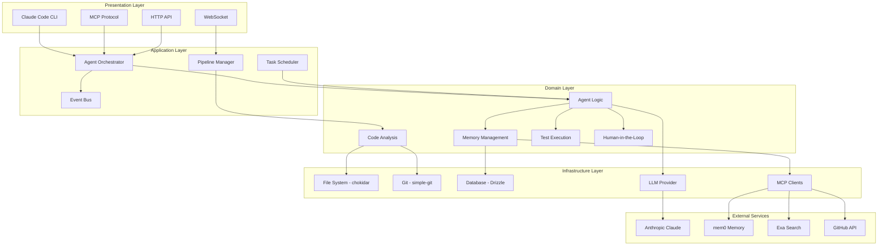
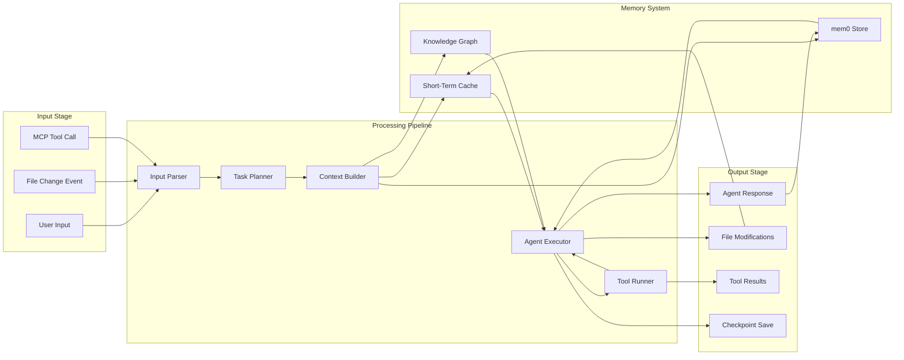
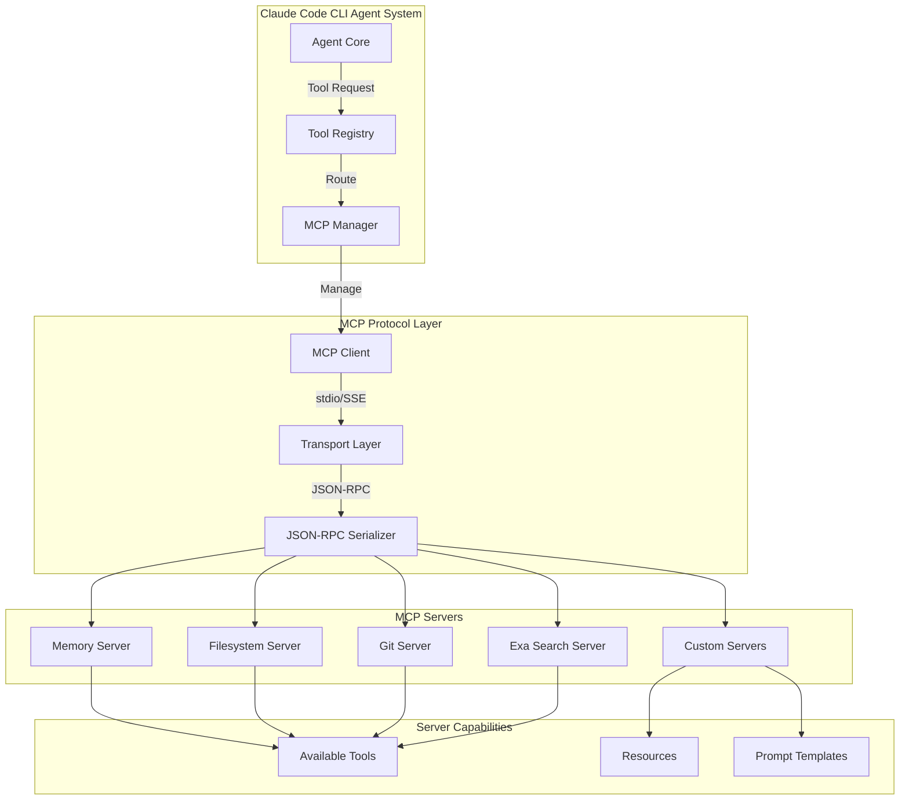
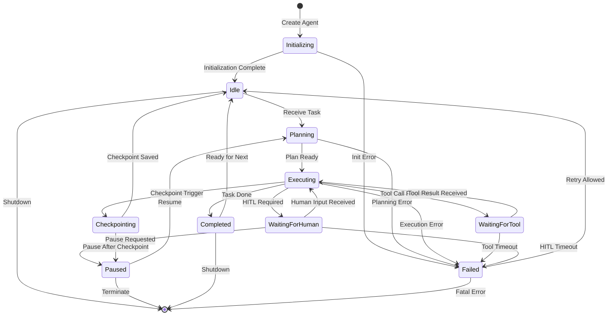
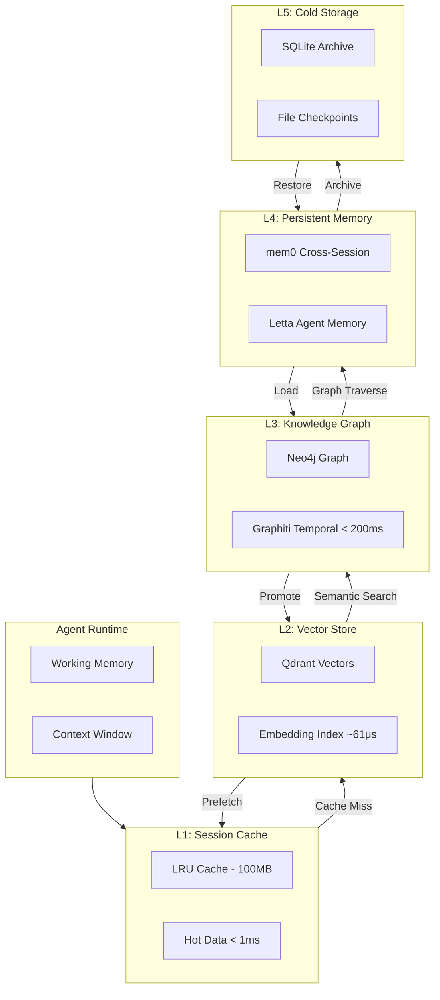

# Claude Code CLI Optimized System Architecture

**Version:** 1.0  
**Created:** 2026-01-24  
**Focus:** Performance, Advanced Features, Integrations, Agentic Workflows  
**Target:** Production-grade autonomous coding system

---

## Table of Contents

1. [Executive Summary](#executive-summary)
2. [Directory Structure Convention](#1-directory-structure-convention)
3. [Module Organization Principles](#2-module-organization-principles)
4. [Inter-Component Communication Patterns](#3-inter-component-communication-patterns)
5. [Error Propagation & Recovery Strategies](#4-error-propagation--recovery-strategies)
6. [State Management Approaches](#5-state-management-approaches)
7. [Agentic Workflow Patterns](#6-agentic-workflow-patterns)
8. [Architecture Diagrams](#7-architecture-diagrams)
9. [SDK Integration Reference](#8-sdk-integration-reference)
10. [Implementation Checklist](#9-implementation-checklist)

---

## Executive Summary

This architecture defines a cohesive system optimized for **Claude Code CLI's autonomous coding capabilities**. The design prioritizes:

- **Streaming-First Operations** - All I/O supports streaming for responsive agent interactions
- **Deterministic Reproducibility** - Seeding and checkpointing enable reproducible runs
- **Large Codebase Efficiency** - Handle 10K+ files with incremental processing
- **MCP-Native Integration** - First-class Model Context Protocol support
- **Type-Safe Boundaries** - Full TypeScript/Python type coverage at interfaces
- **Observable Operations** - Built-in tracing, metrics, and structured logging

### Core SDK Stack

| Domain | Primary | Secondary | Purpose |
|--------|---------|-----------|---------|
| **Orchestration** | claude-flow-v3 | fast-agent | Multi-agent coordination |
| **File System** | chokidar | memfs, lru-cache | Watch, virtual FS, caching |
| **Git Operations** | simple-git | isomorphic-git | Repository manipulation |
| **AST/Parsing** | ast-grep | tree-sitter | 56 languages, 10-100x faster |
| **Testing** | Vitest/pytest+hypothesis | fast-check | Property-based testing |
| **AI Functions** | BAML | - | Type-safe structured output |
| **Memory Layer** | mem0 | letta | +26% accuracy, persistence |
| **HTTP/API** | ky/httpx | got | Streaming HTTP |
| **Database** | Drizzle/SQLAlchemy 2.0 | Prisma | Type-safe ORM |
| **MCP Server** | FastMCP/@mcp/sdk | - | Tool protocol |
| **Logging** | pino/structlog | OpenTelemetry | Structured observability |

---

## 1. Directory Structure Convention

### Root Layout for Autonomous Operations

```
project/
├── .claude/                     # Claude Code CLI configuration
│   ├── settings.json            # Project-specific settings
│   ├── agents/                  # Agent definitions
│   │   ├── coder.md            # Coder agent system prompt
│   │   ├── tester.md           # Tester agent prompt
│   │   ├── reviewer.md         # Reviewer agent prompt
│   │   └── architect.md        # Architect agent prompt
│   ├── hooks/                   # Pre/PostToolUse hooks
│   │   ├── pre_tool_use.py     # Validation before tool execution
│   │   └── post_tool_use.py    # Post-processing after tools
│   └── mcp/                     # MCP server configs
│       └── servers.json         # Local MCP server registry
│
├── .state/                      # Agent state persistence
│   ├── sessions/               # Session state files
│   │   └── {session_id}.json   # Per-session context
│   ├── memory/                 # Cross-session memory
│   │   ├── entities.json       # Knowledge graph entities
│   │   ├── relations.json      # Entity relationships
│   │   └── embeddings/         # Vector embeddings cache
│   ├── checkpoints/            # Resumable operation states
│   │   └── {task_id}/          # Task-specific checkpoints
│   └── iteration-state.json    # Global iteration tracking
│
├── .cache/                      # High-performance caches
│   ├── ast/                    # Parsed AST cache
│   │   └── {file_hash}.ast     # Per-file AST (LRU eviction)
│   ├── embeddings/             # Vector embedding cache
│   ├── mcp/                    # MCP response cache
│   └── git/                    # Git object cache
│
├── src/                         # Application source
│   ├── core/                   # Core domain logic
│   ├── adapters/               # External SDK wrappers
│   ├── pipelines/              # Processing pipelines
│   └── agents/                 # Agent implementations
│
├── platform/                    # Platform infrastructure
│   ├── orchestrator/           # Multi-agent orchestration
│   ├── memory/                 # Memory subsystem
│   ├── mcp/                    # MCP integration layer
│   └── telemetry/              # Observability
│
├── sdks/                        # Vendored/linked SDKs
│   ├── claude-flow/            # Multi-agent coordination
│   ├── ast-grep/               # Pattern matching
│   └── baml/                   # Type-safe AI functions
│
├── tests/                       # Test suites
│   ├── unit/                   # Unit tests
│   ├── integration/            # Integration tests
│   └── e2e/                    # End-to-end tests
│
└── docs/                        # Documentation
    ├── architecture/           # Architecture docs
    └── agents/                 # Agent documentation
```

### Key Directory Purposes

| Directory | Purpose | Persistence | Size Management |
|-----------|---------|-------------|-----------------|
| `.claude/` | Configuration | Git tracked | Small, static |
| `.state/` | Agent state | Git ignored | Pruned by age |
| `.cache/` | Performance cache | Git ignored | LRU eviction |
| `src/core/` | Business logic | Git tracked | No generated |
| `platform/` | Infrastructure | Git tracked | No generated |

### File Naming Conventions

```
# Agent definitions
.claude/agents/{role}.md           # e.g., coder.md, tester.md

# State files
.state/sessions/{uuid}.json        # Session state
.state/checkpoints/{task}/{seq}.cp # Checkpoint files

# Cache files
.cache/ast/{sha256[:16]}.ast       # AST by content hash
.cache/embeddings/{model}/{hash}   # Embeddings by model

# Configuration
{module}/config.ts                 # TypeScript config
{module}/config.py                 # Python config
```

---

## 2. Module Organization Principles

### Layered Architecture

```
┌─────────────────────────────────────────────────────────────────┐
│                     PRESENTATION LAYER                          │
│   CLI Interface │ MCP Protocol │ HTTP API │ WebSocket           │
├─────────────────────────────────────────────────────────────────┤
│                     APPLICATION LAYER                           │
│   Agent Orchestrator │ Pipeline Manager │ Task Scheduler        │
├─────────────────────────────────────────────────────────────────┤
│                      DOMAIN LAYER                               │
│   Agent Logic │ Memory Management │ Code Analysis │ Testing     │
├─────────────────────────────────────────────────────────────────┤
│                   INFRASTRUCTURE LAYER                          │
│   File System │ Git │ Database │ MCP Clients │ External APIs    │
└─────────────────────────────────────────────────────────────────┘
```

### Clean Architecture Boundaries

```typescript
// src/core/interfaces.ts - Domain interfaces
interface ICodeAnalyzer {
  analyze(file: FilePath): Promise<AnalysisResult>;
  findPatterns(pattern: AstPattern): AsyncIterable<Match>;
}

interface IMemoryStore {
  store(key: string, value: Memory): Promise<void>;
  retrieve(query: MemoryQuery): Promise<Memory[]>;
  search(embedding: Vector, k: number): Promise<ScoredMemory[]>;
}

// src/adapters/ast-grep-analyzer.ts - Adapter implementation
class AstGrepAnalyzer implements ICodeAnalyzer {
  constructor(private readonly astGrep: AstGrepClient) {}
  
  async analyze(file: FilePath): Promise<AnalysisResult> {
    // Adapter wraps ast-grep SDK
    return this.astGrep.parse(file);
  }
}
```

### Plugin System Architecture

```typescript
// platform/plugins/registry.ts
interface Plugin {
  name: string;
  version: string;
  capabilities: PluginCapability[];
  
  onLoad(context: PluginContext): Promise<void>;
  onUnload(): Promise<void>;
}

interface PluginCapability {
  type: 'analyzer' | 'transformer' | 'agent' | 'mcp-server';
  register(registry: CapabilityRegistry): void;
}

// Example plugin registration
const astGrepPlugin: Plugin = {
  name: 'ast-grep',
  version: '0.30.0',
  capabilities: [{
    type: 'analyzer',
    register(registry) {
      registry.registerAnalyzer('ast-grep', AstGrepAnalyzer);
    }
  }]
};
```

### Adapter Pattern for SDKs

```python
# platform/adapters/base.py
from abc import ABC, abstractmethod
from typing import Generic, TypeVar

T = TypeVar('T')

class SDKAdapter(ABC, Generic[T]):
    """Base adapter for external SDK integration."""
    
    @abstractmethod
    async def initialize(self) -> None:
        """Initialize the SDK connection."""
        pass
    
    @abstractmethod
    async def health_check(self) -> bool:
        """Check if the SDK is responsive."""
        pass
    
    @abstractmethod
    def get_client(self) -> T:
        """Get the underlying SDK client."""
        pass

# platform/adapters/mem0_adapter.py
class Mem0Adapter(SDKAdapter[Mem0Client]):
    """Adapter for mem0 memory layer."""
    
    def __init__(self, config: Mem0Config):
        self._config = config
        self._client: Optional[Mem0Client] = None
    
    async def initialize(self) -> None:
        self._client = Mem0Client(
            api_key=self._config.api_key,
            collection=self._config.collection
        )
    
    async def store_memory(
        self, 
        content: str, 
        metadata: Dict[str, Any]
    ) -> MemoryId:
        """Store with automatic embedding generation."""
        return await self._client.add(
            content=content,
            metadata=metadata,
            user_id=self._config.user_id
        )
```

---

## 3. Inter-Component Communication Patterns

### Event-Driven Architecture for Agent Coordination

```typescript
// platform/events/types.ts
type AgentEvent = 
  | { type: 'TASK_ASSIGNED'; payload: TaskAssignment }
  | { type: 'TASK_COMPLETED'; payload: TaskResult }
  | { type: 'CHECKPOINT_CREATED'; payload: Checkpoint }
  | { type: 'MEMORY_UPDATED'; payload: MemoryUpdate }
  | { type: 'ERROR_OCCURRED'; payload: AgentError };

// platform/events/bus.ts
class EventBus {
  private subscribers = new Map<string, Set<EventHandler>>();
  
  async publish<E extends AgentEvent>(event: E): Promise<void> {
    const handlers = this.subscribers.get(event.type) ?? new Set();
    await Promise.all(
      Array.from(handlers).map(h => h(event))
    );
  }
  
  subscribe<E extends AgentEvent>(
    type: E['type'], 
    handler: (event: E) => Promise<void>
  ): Unsubscribe {
    const handlers = this.subscribers.get(type) ?? new Set();
    handlers.add(handler as EventHandler);
    this.subscribers.set(type, handlers);
    return () => handlers.delete(handler as EventHandler);
  }
}
```

### Message Queue for Async Operations

```python
# platform/queues/task_queue.py
from dataclasses import dataclass
from typing import AsyncIterator
import asyncio

@dataclass
class QueuedTask:
    id: str
    priority: int
    payload: dict
    created_at: float
    retries: int = 0

class PriorityTaskQueue:
    """Priority queue for async task processing."""
    
    def __init__(self, max_concurrent: int = 10):
        self._queue: asyncio.PriorityQueue[tuple[int, QueuedTask]] = \
            asyncio.PriorityQueue()
        self._semaphore = asyncio.Semaphore(max_concurrent)
        self._workers: list[asyncio.Task] = []
    
    async def enqueue(self, task: QueuedTask) -> None:
        # Lower priority number = higher priority
        await self._queue.put((-task.priority, task))
    
    async def process(
        self, 
        handler: Callable[[QueuedTask], Awaitable[TaskResult]]
    ) -> AsyncIterator[TaskResult]:
        while True:
            async with self._semaphore:
                _, task = await self._queue.get()
                try:
                    result = await handler(task)
                    yield result
                except Exception as e:
                    if task.retries < 3:
                        task.retries += 1
                        await self.enqueue(task)
                    else:
                        yield TaskResult.failure(task.id, e)
```

### Streaming Protocols for LLM Responses

```typescript
// platform/streaming/llm-stream.ts
interface StreamChunk {
  type: 'text' | 'tool_use' | 'tool_result' | 'thinking';
  content: string;
  metadata?: Record<string, unknown>;
}

async function* streamLLMResponse(
  client: AnthropicClient,
  messages: Message[]
): AsyncGenerator<StreamChunk, void, unknown> {
  const stream = await client.messages.stream({
    model: 'claude-sonnet-4-20250514',
    messages,
    max_tokens: 8192
  });
  
  for await (const event of stream) {
    if (event.type === 'content_block_delta') {
      yield {
        type: 'text',
        content: event.delta.text ?? ''
      };
    } else if (event.type === 'message_delta') {
      if (event.usage) {
        yield {
          type: 'thinking',
          content: '',
          metadata: { tokens: event.usage }
        };
      }
    }
  }
}

// Usage with backpressure handling
class StreamProcessor {
  async processStream(
    stream: AsyncGenerator<StreamChunk>,
    onChunk: (chunk: StreamChunk) => Promise<void>
  ): Promise<void> {
    const buffer: StreamChunk[] = [];
    const maxBuffer = 100;
    
    for await (const chunk of stream) {
      buffer.push(chunk);
      
      // Process in batches for efficiency
      if (buffer.length >= maxBuffer) {
        await Promise.all(buffer.map(onChunk));
        buffer.length = 0;
      }
    }
    
    // Process remaining
    if (buffer.length > 0) {
      await Promise.all(buffer.map(onChunk));
    }
  }
}
```

### MCP Protocol Integration Points

```typescript
// platform/mcp/integration.ts
import { Client } from '@modelcontextprotocol/sdk/client';
import { StdioClientTransport } from '@modelcontextprotocol/sdk/client/stdio';

interface MCPIntegration {
  servers: Map<string, MCPServer>;
  tools: Map<string, MCPTool>;
  resources: Map<string, MCPResource>;
}

class MCPManager {
  private clients = new Map<string, Client>();
  
  async connectServer(config: MCPServerConfig): Promise<void> {
    const transport = new StdioClientTransport({
      command: config.command,
      args: config.args,
      env: config.env
    });
    
    const client = new Client({
      name: 'claude-cli',
      version: '1.0.0'
    });
    
    await client.connect(transport);
    this.clients.set(config.name, client);
    
    // Register tools from this server
    const tools = await client.listTools();
    for (const tool of tools.tools) {
      this.registerTool(config.name, tool);
    }
  }
  
  async callTool(
    serverName: string, 
    toolName: string, 
    args: Record<string, unknown>
  ): Promise<ToolResult> {
    const client = this.clients.get(serverName);
    if (!client) throw new Error(`Server ${serverName} not connected`);
    
    return client.callTool({ name: toolName, arguments: args });
  }
}
```

---

## 4. Error Propagation & Recovery Strategies

### Result Types vs Exceptions

```typescript
// platform/errors/result.ts
type Result<T, E = Error> = 
  | { ok: true; value: T }
  | { ok: false; error: E };

// Functional helpers
const ok = <T>(value: T): Result<T, never> => ({ ok: true, value });
const err = <E>(error: E): Result<never, E> => ({ ok: false, error });

// Usage in operations that might fail
async function parseCode(
  content: string, 
  language: Language
): Promise<Result<AST, ParseError>> {
  try {
    const ast = await astGrep.parse(content, language);
    return ok(ast);
  } catch (e) {
    return err(new ParseError(e.message, { content, language }));
  }
}

// Chaining results
async function analyzeFile(path: string): Promise<Result<Analysis, AnalysisError>> {
  const contentResult = await readFile(path);
  if (!contentResult.ok) return err(new AnalysisError('Read failed', contentResult.error));
  
  const parseResult = await parseCode(contentResult.value, detectLanguage(path));
  if (!parseResult.ok) return err(new AnalysisError('Parse failed', parseResult.error));
  
  return ok(analyze(parseResult.value));
}
```

### Retry Strategies with Exponential Backoff

```python
# platform/resilience/retry.py
import asyncio
from dataclasses import dataclass
from typing import TypeVar, Callable, Awaitable
import random

T = TypeVar('T')

@dataclass
class RetryConfig:
    max_attempts: int = 3
    base_delay: float = 1.0
    max_delay: float = 60.0
    exponential_base: float = 2.0
    jitter: bool = True

async def retry_with_backoff(
    operation: Callable[[], Awaitable[T]],
    config: RetryConfig = RetryConfig(),
    should_retry: Callable[[Exception], bool] = lambda _: True
) -> T:
    """Execute operation with exponential backoff retry."""
    last_error: Exception | None = None
    
    for attempt in range(config.max_attempts):
        try:
            return await operation()
        except Exception as e:
            last_error = e
            
            if not should_retry(e) or attempt == config.max_attempts - 1:
                raise
            
            delay = min(
                config.base_delay * (config.exponential_base ** attempt),
                config.max_delay
            )
            
            if config.jitter:
                delay *= (0.5 + random.random())
            
            await asyncio.sleep(delay)
    
    raise last_error  # Should never reach here
```

### Circuit Breaker Pattern

```typescript
// platform/resilience/circuit-breaker.ts
type CircuitState = 'CLOSED' | 'OPEN' | 'HALF_OPEN';

interface CircuitBreakerConfig {
  failureThreshold: number;      // Failures before opening
  successThreshold: number;      // Successes to close from half-open
  timeout: number;               // Time in OPEN before trying half-open
  volumeThreshold: number;       // Minimum calls before evaluating
}

class CircuitBreaker<T> {
  private state: CircuitState = 'CLOSED';
  private failures = 0;
  private successes = 0;
  private lastFailureTime?: number;
  private calls = 0;
  
  constructor(
    private operation: () => Promise<T>,
    private config: CircuitBreakerConfig
  ) {}
  
  async execute(): Promise<T> {
    if (this.state === 'OPEN') {
      if (Date.now() - (this.lastFailureTime ?? 0) > this.config.timeout) {
        this.state = 'HALF_OPEN';
        this.successes = 0;
      } else {
        throw new CircuitOpenError('Circuit is OPEN');
      }
    }
    
    try {
      const result = await this.operation();
      this.onSuccess();
      return result;
    } catch (error) {
      this.onFailure();
      throw error;
    }
  }
  
  private onSuccess(): void {
    this.failures = 0;
    this.calls++;
    
    if (this.state === 'HALF_OPEN') {
      this.successes++;
      if (this.successes >= this.config.successThreshold) {
        this.state = 'CLOSED';
      }
    }
  }
  
  private onFailure(): void {
    this.failures++;
    this.calls++;
    this.lastFailureTime = Date.now();
    
    if (this.calls >= this.config.volumeThreshold &&
        this.failures >= this.config.failureThreshold) {
      this.state = 'OPEN';
    }
    
    if (this.state === 'HALF_OPEN') {
      this.state = 'OPEN';
    }
  }
  
  getState(): CircuitState {
    return this.state;
  }
}
```

### Recovery Checkpoints for Long-Running Operations

```python
# platform/checkpoints/manager.py
from dataclasses import dataclass, asdict
from pathlib import Path
import json
from typing import TypeVar, Generic

T = TypeVar('T')

@dataclass
class Checkpoint(Generic[T]):
    task_id: str
    sequence: int
    state: T
    timestamp: float
    metadata: dict

class CheckpointManager:
    """Manages checkpoints for resumable long-running operations."""
    
    def __init__(self, base_path: Path):
        self.base_path = base_path
        self.base_path.mkdir(parents=True, exist_ok=True)
    
    def checkpoint_path(self, task_id: str, sequence: int) -> Path:
        task_dir = self.base_path / task_id
        task_dir.mkdir(exist_ok=True)
        return task_dir / f"{sequence:06d}.checkpoint"
    
    async def save(self, checkpoint: Checkpoint) -> None:
        """Save checkpoint atomically."""
        path = self.checkpoint_path(checkpoint.task_id, checkpoint.sequence)
        temp_path = path.with_suffix('.tmp')
        
        async with aiofiles.open(temp_path, 'w') as f:
            await f.write(json.dumps(asdict(checkpoint)))
        
        temp_path.rename(path)  # Atomic on most filesystems
    
    async def load_latest(self, task_id: str) -> Checkpoint | None:
        """Load the most recent checkpoint for a task."""
        task_dir = self.base_path / task_id
        if not task_dir.exists():
            return None
        
        checkpoints = sorted(task_dir.glob('*.checkpoint'), reverse=True)
        if not checkpoints:
            return None
        
        async with aiofiles.open(checkpoints[0], 'r') as f:
            data = json.loads(await f.read())
            return Checkpoint(**data)
    
    async def cleanup_old(self, task_id: str, keep: int = 5) -> None:
        """Remove old checkpoints, keeping the most recent."""
        task_dir = self.base_path / task_id
        checkpoints = sorted(task_dir.glob('*.checkpoint'), reverse=True)
        
        for old in checkpoints[keep:]:
            old.unlink()
```

### Graceful Degradation

```typescript
// platform/degradation/fallbacks.ts
interface ServiceHealth {
  service: string;
  healthy: boolean;
  latency: number;
  lastChecked: Date;
}

class GracefulDegradation {
  private healthStatus = new Map<string, ServiceHealth>();
  private fallbacks = new Map<string, () => Promise<unknown>>();
  
  registerFallback<T>(
    service: string,
    primary: () => Promise<T>,
    fallback: () => Promise<T>
  ): () => Promise<T> {
    this.fallbacks.set(service, fallback);
    
    return async () => {
      const health = this.healthStatus.get(service);
      
      // Use fallback if service is unhealthy
      if (health && !health.healthy) {
        console.warn(`${service} unhealthy, using fallback`);
        return (this.fallbacks.get(service) as () => Promise<T>)();
      }
      
      try {
        const start = Date.now();
        const result = await primary();
        
        this.healthStatus.set(service, {
          service,
          healthy: true,
          latency: Date.now() - start,
          lastChecked: new Date()
        });
        
        return result;
      } catch (error) {
        this.healthStatus.set(service, {
          service,
          healthy: false,
          latency: -1,
          lastChecked: new Date()
        });
        
        console.warn(`${service} failed, using fallback:`, error);
        return (this.fallbacks.get(service) as () => Promise<T>)();
      }
    };
  }
}

// Usage example
const degradation = new GracefulDegradation();

const searchCode = degradation.registerFallback(
  'ast-grep',
  async () => astGrep.search(pattern),  // Primary
  async () => ripgrep.search(regex)      // Fallback to ripgrep
);
```

---

## 5. State Management Approaches

### Session State Persistence

```typescript
// platform/state/session.ts
interface SessionState {
  id: string;
  agentId: string;
  startedAt: Date;
  lastActivity: Date;
  
  // Conversation context
  messages: Message[];
  workingMemory: Map<string, unknown>;
  
  // Current task state
  currentTask?: TaskState;
  pendingTools: ToolCall[];
  
  // Resource handles
  openFiles: Set<string>;
  watchers: Map<string, FSWatcher>;
}

class SessionManager {
  private sessions = new Map<string, SessionState>();
  private persistence: SessionPersistence;
  
  async getOrCreate(sessionId: string): Promise<SessionState> {
    let session = this.sessions.get(sessionId);
    
    if (!session) {
      // Try to restore from disk
      session = await this.persistence.load(sessionId);
      
      if (!session) {
        session = this.createNew(sessionId);
      }
      
      this.sessions.set(sessionId, session);
    }
    
    return session;
  }
  
  async checkpoint(sessionId: string): Promise<void> {
    const session = this.sessions.get(sessionId);
    if (session) {
      await this.persistence.save(session);
    }
  }
  
  // Auto-save on activity
  @debounce(5000)
  private async autoSave(sessionId: string): Promise<void> {
    await this.checkpoint(sessionId);
  }
}
```

### Cross-Session Memory with mem0 Integration

```python
# platform/memory/cross_session.py
from mem0 import Memory
from typing import List, Dict, Any
from dataclasses import dataclass

@dataclass
class CrossSessionMemory:
    """Memory that persists across sessions."""
    id: str
    content: str
    metadata: Dict[str, Any]
    timestamp: float
    session_ids: List[str]  # Sessions that accessed this memory

class Mem0Integration:
    """Integrates mem0 for cross-session memory with +26% accuracy boost."""
    
    def __init__(self, config: Mem0Config):
        self.memory = Memory.from_config({
            "graph_store": {
                "provider": "neo4j",
                "config": {
                    "url": config.neo4j_url,
                    "username": config.neo4j_user,
                    "password": config.neo4j_password
                }
            },
            "vector_store": {
                "provider": "qdrant",
                "config": {
                    "collection_name": config.collection,
                    "host": config.qdrant_host,
                    "port": config.qdrant_port
                }
            },
            "llm": {
                "provider": "anthropic",
                "config": {
                    "model": "claude-sonnet-4-20250514"
                }
            }
        })
    
    async def remember(
        self, 
        content: str, 
        session_id: str,
        metadata: Dict[str, Any] = None
    ) -> str:
        """Store memory with automatic relation extraction."""
        result = await self.memory.add(
            content,
            user_id=session_id,
            metadata=metadata or {}
        )
        return result["id"]
    
    async def recall(
        self, 
        query: str, 
        session_id: str,
        k: int = 10
    ) -> List[CrossSessionMemory]:
        """Retrieve relevant memories using hybrid search."""
        results = await self.memory.search(
            query,
            user_id=session_id,
            limit=k
        )
        
        return [
            CrossSessionMemory(
                id=r["id"],
                content=r["memory"],
                metadata=r["metadata"],
                timestamp=r["created_at"],
                session_ids=r.get("session_ids", [session_id])
            )
            for r in results
        ]
    
    async def get_knowledge_graph(
        self, 
        session_id: str
    ) -> Dict[str, Any]:
        """Get the knowledge graph for context injection."""
        return await self.memory.get_all(user_id=session_id)
```

### Agent State Snapshots

```typescript
// platform/state/agent-snapshot.ts
interface AgentSnapshot {
  version: string;
  timestamp: number;
  
  // Agent configuration
  config: AgentConfig;
  systemPrompt: string;
  
  // Runtime state
  state: {
    phase: AgentPhase;
    context: ContextWindow;
    toolResults: ToolResult[];
    decisions: Decision[];
  };
  
  // Memory state
  memory: {
    shortTerm: ShortTermMemory;
    workingSet: WorkingMemory;
    retrieved: RetrievedMemory[];
  };
  
  // Performance metrics
  metrics: {
    tokensUsed: number;
    toolCalls: number;
    latencyMs: number;
    errors: number;
  };
}

class AgentSnapshotManager {
  async capture(agent: Agent): Promise<AgentSnapshot> {
    return {
      version: '1.0',
      timestamp: Date.now(),
      config: agent.getConfig(),
      systemPrompt: agent.getSystemPrompt(),
      state: {
        phase: agent.getCurrentPhase(),
        context: await agent.getContextWindow(),
        toolResults: agent.getToolResults(),
        decisions: agent.getDecisionLog()
      },
      memory: {
        shortTerm: await agent.memory.getShortTerm(),
        workingSet: await agent.memory.getWorkingSet(),
        retrieved: await agent.memory.getRetrieved()
      },
      metrics: agent.getMetrics()
    };
  }
  
  async restore(snapshot: AgentSnapshot): Promise<Agent> {
    const agent = new Agent(snapshot.config);
    agent.setSystemPrompt(snapshot.systemPrompt);
    
    // Restore state
    await agent.setState(snapshot.state);
    
    // Restore memory
    await agent.memory.restore(snapshot.memory);
    
    return agent;
  }
}
```

### Transaction Management for Atomic Operations

```python
# platform/state/transactions.py
from contextlib import asynccontextmanager
from typing import AsyncGenerator, List, Callable, Awaitable
import asyncio

class TransactionManager:
    """Manages atomic multi-resource transactions."""
    
    @asynccontextmanager
    async def transaction(
        self,
        resources: List[str]
    ) -> AsyncGenerator['Transaction', None]:
        """Context manager for atomic operations."""
        tx = Transaction(resources)
        
        try:
            await tx.begin()
            yield tx
            await tx.commit()
        except Exception as e:
            await tx.rollback()
            raise TransactionError(f"Transaction failed: {e}") from e

class Transaction:
    def __init__(self, resources: List[str]):
        self.resources = resources
        self.operations: List[Callable[[], Awaitable[None]]] = []
        self.rollback_operations: List[Callable[[], Awaitable[None]]] = []
    
    async def begin(self) -> None:
        """Acquire locks on all resources."""
        for resource in self.resources:
            await self._lock(resource)
    
    def add_operation(
        self,
        forward: Callable[[], Awaitable[None]],
        backward: Callable[[], Awaitable[None]]
    ) -> None:
        """Add an operation with its rollback."""
        self.operations.append(forward)
        self.rollback_operations.append(backward)
    
    async def commit(self) -> None:
        """Execute all operations."""
        for op in self.operations:
            await op()
        await self._release_locks()
    
    async def rollback(self) -> None:
        """Rollback all completed operations in reverse order."""
        for op in reversed(self.rollback_operations[:len(self.operations)]):
            try:
                await op()
            except Exception as e:
                # Log but continue rolling back
                print(f"Rollback error: {e}")
        await self._release_locks()
```

### Idempotency for Retryable Operations

```typescript
// platform/idempotency/keys.ts
interface IdempotencyRecord {
  key: string;
  result: unknown;
  expiresAt: Date;
  requestHash: string;
}

class IdempotencyManager {
  private store: KeyValueStore;
  
  async executeIdempotent<T>(
    key: string,
    request: unknown,
    operation: () => Promise<T>,
    ttlMs: number = 24 * 60 * 60 * 1000  // 24 hours
  ): Promise<T> {
    const requestHash = hash(JSON.stringify(request));
    
    // Check for existing result
    const existing = await this.store.get<IdempotencyRecord>(key);
    
    if (existing) {
      // Verify request matches
      if (existing.requestHash !== requestHash) {
        throw new IdempotencyConflictError(
          `Key ${key} used with different request`
        );
      }
      
      // Return cached result
      return existing.result as T;
    }
    
    // Execute operation
    const result = await operation();
    
    // Store result
    await this.store.set<IdempotencyRecord>(key, {
      key,
      result,
      expiresAt: new Date(Date.now() + ttlMs),
      requestHash
    });
    
    return result;
  }
}

// Usage
const idempotency = new IdempotencyManager(store);

async function createFile(path: string, content: string): Promise<void> {
  const key = `create-file:${hash(path)}`;
  
  await idempotency.executeIdempotent(
    key,
    { path, contentHash: hash(content) },
    async () => {
      await fs.writeFile(path, content);
    }
  );
}
```

---

## 6. Agentic Workflow Patterns

### Agent Lifecycle Management

```python
# platform/agents/lifecycle.py
from enum import Enum, auto
from dataclasses import dataclass
from typing import Optional, Dict, Any

class AgentPhase(Enum):
    INITIALIZING = auto()
    IDLE = auto()
    PLANNING = auto()
    EXECUTING = auto()
    WAITING_FOR_TOOL = auto()
    WAITING_FOR_HUMAN = auto()
    CHECKPOINTING = auto()
    PAUSED = auto()
    COMPLETED = auto()
    FAILED = auto()

@dataclass
class AgentState:
    phase: AgentPhase
    current_task: Optional[str]
    progress: float  # 0.0 to 1.0
    context: Dict[str, Any]
    checkpoint_id: Optional[str]

class AgentLifecycleManager:
    """Manages agent lifecycle: create, execute, checkpoint, resume."""
    
    async def create_agent(
        self, 
        config: AgentConfig,
        initial_context: Dict[str, Any] = None
    ) -> Agent:
        """Create and initialize a new agent."""
        agent = Agent(config)
        agent.state = AgentState(
            phase=AgentPhase.INITIALIZING,
            current_task=None,
            progress=0.0,
            context=initial_context or {},
            checkpoint_id=None
        )
        
        # Load system prompt and tools
        await agent.initialize()
        
        # Inject initial memory context
        if config.memory_integration:
            memories = await self.memory.recall(
                config.initial_query or "",
                agent.session_id
            )
            agent.inject_context(memories)
        
        agent.state.phase = AgentPhase.IDLE
        return agent
    
    async def execute(
        self, 
        agent: Agent, 
        task: Task
    ) -> TaskResult:
        """Execute a task with the agent."""
        agent.state.phase = AgentPhase.PLANNING
        agent.state.current_task = task.id
        
        try:
            # Plan the execution
            plan = await agent.plan(task)
            
            agent.state.phase = AgentPhase.EXECUTING
            
            for step in plan.steps:
                # Check for checkpoint/pause requests
                if agent.should_checkpoint():
                    await self.checkpoint(agent)
                
                if agent.should_pause():
                    agent.state.phase = AgentPhase.PAUSED
                    return TaskResult.paused(task.id)
                
                # Execute step
                result = await agent.execute_step(step)
                agent.state.progress = step.sequence / len(plan.steps)
                
                # Handle tool calls
                if result.requires_tool:
                    agent.state.phase = AgentPhase.WAITING_FOR_TOOL
                    tool_result = await self.execute_tool(result.tool_call)
                    agent.receive_tool_result(tool_result)
                    agent.state.phase = AgentPhase.EXECUTING
                
                # Handle human-in-the-loop
                if result.requires_human:
                    agent.state.phase = AgentPhase.WAITING_FOR_HUMAN
                    human_input = await self.request_human_input(result.prompt)
                    agent.receive_human_input(human_input)
                    agent.state.phase = AgentPhase.EXECUTING
            
            agent.state.phase = AgentPhase.COMPLETED
            return TaskResult.success(task.id, agent.get_output())
            
        except Exception as e:
            agent.state.phase = AgentPhase.FAILED
            await self.checkpoint(agent)  # Save state for debugging
            return TaskResult.failure(task.id, e)
    
    async def checkpoint(self, agent: Agent) -> str:
        """Create a checkpoint for resume."""
        agent.state.phase = AgentPhase.CHECKPOINTING
        
        snapshot = await self.snapshot_manager.capture(agent)
        checkpoint_id = await self.checkpoint_store.save(snapshot)
        
        agent.state.checkpoint_id = checkpoint_id
        agent.state.phase = AgentPhase.IDLE
        
        return checkpoint_id
    
    async def resume(self, checkpoint_id: str) -> Agent:
        """Resume an agent from a checkpoint."""
        snapshot = await self.checkpoint_store.load(checkpoint_id)
        agent = await self.snapshot_manager.restore(snapshot)
        
        agent.state.phase = AgentPhase.IDLE
        return agent
```

### Multi-Agent Coordination with claude-flow

```typescript
// platform/orchestration/claude-flow-integration.ts
import { ClaudeFlow, SwarmConfig, Agent as FlowAgent } from 'claude-flow';

interface CoordinationConfig {
  topology: 'hierarchical' | 'mesh' | 'ring' | 'star';
  consensus: 'raft' | 'byzantine' | 'gossip' | 'majority';
  maxAgents: number;
}

class MultiAgentCoordinator {
  private flow: ClaudeFlow;
  private agents = new Map<string, FlowAgent>();
  
  async initialize(config: CoordinationConfig): Promise<void> {
    this.flow = new ClaudeFlow({
      swarm: {
        type: config.topology,
        consensus: config.consensus,
        maxWorkers: config.maxAgents
      }
    });
    
    await this.flow.start();
  }
  
  async spawnAgent(role: AgentRole): Promise<string> {
    const agentConfig = this.getAgentConfig(role);
    
    const agent = await this.flow.spawnAgent({
      name: `${role.name}-${generateId()}`,
      systemPrompt: agentConfig.systemPrompt,
      tools: agentConfig.tools,
      memory: {
        type: 'shared',
        namespace: 'coordination'
      }
    });
    
    this.agents.set(agent.id, agent);
    return agent.id;
  }
  
  async coordinate(
    task: Task,
    agents: string[]
  ): Promise<CoordinationResult> {
    // Create coordination context
    const context = await this.flow.createContext({
      task: task.description,
      agents: agents.map(id => this.agents.get(id)!)
    });
    
    // Run swarm coordination
    const result = await this.flow.runSwarm({
      context,
      mode: 'hierarchical',  // Queen-led coordination
      convergence: {
        type: 'consensus',
        threshold: 0.8
      }
    });
    
    return {
      success: result.converged,
      output: result.finalOutput,
      agentContributions: result.contributions,
      consensusMetrics: result.metrics
    };
  }
}
```

### Tool Execution Framework

```python
# platform/tools/executor.py
from dataclasses import dataclass
from typing import Dict, Any, List, Callable, Awaitable
import asyncio

@dataclass
class ToolSpec:
    name: str
    description: str
    parameters: Dict[str, Any]  # JSON Schema
    handler: Callable[[Dict[str, Any]], Awaitable[Any]]
    timeout_seconds: float = 30.0
    requires_confirmation: bool = False

class ToolExecutor:
    """Manages tool registration and execution."""
    
    def __init__(self):
        self.tools: Dict[str, ToolSpec] = {}
        self.hooks: List[ToolHook] = []
    
    def register(self, spec: ToolSpec) -> None:
        """Register a tool."""
        self.tools[spec.name] = spec
    
    def register_hook(self, hook: ToolHook) -> None:
        """Register pre/post execution hooks."""
        self.hooks.append(hook)
    
    async def execute(
        self, 
        tool_name: str, 
        args: Dict[str, Any],
        context: ExecutionContext
    ) -> ToolResult:
        """Execute a tool with all hooks."""
        spec = self.tools.get(tool_name)
        if not spec:
            return ToolResult.error(f"Unknown tool: {tool_name}")
        
        # Run pre-hooks
        for hook in self.hooks:
            decision = await hook.pre_tool_use(tool_name, args, context)
            if decision.action == 'block':
                return ToolResult.blocked(decision.reason)
            elif decision.action == 'modify':
                args = decision.modified_args
        
        # Human confirmation if required
        if spec.requires_confirmation:
            approved = await context.request_confirmation(
                f"Allow {tool_name} with args: {args}?"
            )
            if not approved:
                return ToolResult.cancelled("User declined")
        
        # Execute with timeout
        try:
            result = await asyncio.wait_for(
                spec.handler(args),
                timeout=spec.timeout_seconds
            )
        except asyncio.TimeoutError:
            return ToolResult.error(f"Tool {tool_name} timed out")
        except Exception as e:
            return ToolResult.error(str(e))
        
        # Run post-hooks
        for hook in self.hooks:
            result = await hook.post_tool_use(tool_name, args, result, context)
        
        return ToolResult.success(result)
```

### Memory Retrieval and Context Injection

```typescript
// platform/memory/context-injection.ts
interface ContextWindow {
  maxTokens: number;
  usedTokens: number;
  sections: ContextSection[];
}

interface ContextSection {
  type: 'system' | 'memory' | 'task' | 'tool_results' | 'conversation';
  content: string;
  priority: number;  // Higher = more important
  tokens: number;
}

class ContextInjector {
  private tokenizer: Tokenizer;
  
  async buildContext(
    agent: Agent,
    task: Task,
    memoryQuery: string
  ): Promise<ContextWindow> {
    const maxTokens = agent.config.maxContextTokens;
    const sections: ContextSection[] = [];
    
    // 1. System prompt (highest priority)
    sections.push({
      type: 'system',
      content: agent.systemPrompt,
      priority: 100,
      tokens: await this.tokenizer.count(agent.systemPrompt)
    });
    
    // 2. Retrieve relevant memories
    const memories = await agent.memory.search(memoryQuery, {
      limit: 20,
      minScore: 0.7
    });
    
    for (const memory of memories) {
      sections.push({
        type: 'memory',
        content: this.formatMemory(memory),
        priority: 80 + memory.score * 10,
        tokens: await this.tokenizer.count(memory.content)
      });
    }
    
    // 3. Task description
    sections.push({
      type: 'task',
      content: task.description,
      priority: 90,
      tokens: await this.tokenizer.count(task.description)
    });
    
    // 4. Recent tool results
    const recentTools = agent.getRecentToolResults(10);
    for (const result of recentTools) {
      sections.push({
        type: 'tool_results',
        content: this.formatToolResult(result),
        priority: 70,
        tokens: await this.tokenizer.count(JSON.stringify(result))
      });
    }
    
    // 5. Fit into context window by priority
    return this.fitToWindow(sections, maxTokens);
  }
  
  private fitToWindow(
    sections: ContextSection[],
    maxTokens: number
  ): ContextWindow {
    // Sort by priority descending
    const sorted = [...sections].sort((a, b) => b.priority - a.priority);
    
    const included: ContextSection[] = [];
    let usedTokens = 0;
    
    for (const section of sorted) {
      if (usedTokens + section.tokens <= maxTokens) {
        included.push(section);
        usedTokens += section.tokens;
      }
    }
    
    return { maxTokens, usedTokens, sections: included };
  }
}
```

### Human-in-the-Loop Checkpoints

```python
# platform/hitl/checkpoints.py
from dataclasses import dataclass
from typing import Optional, List
from enum import Enum

class HITLType(Enum):
    CONFIRMATION = "confirmation"      # Yes/No decision
    SELECTION = "selection"            # Choose from options
    INPUT = "input"                    # Free-form input
    REVIEW = "review"                  # Review output before proceeding

@dataclass
class HITLCheckpoint:
    id: str
    type: HITLType
    prompt: str
    options: Optional[List[str]] = None  # For SELECTION type
    context: Optional[str] = None        # Additional context
    timeout_seconds: Optional[float] = None
    default_action: Optional[str] = None  # Action if timeout

class HITLManager:
    """Manages human-in-the-loop checkpoints."""
    
    def __init__(self, notifier: HITLNotifier):
        self.notifier = notifier
        self.pending: Dict[str, HITLCheckpoint] = {}
    
    async def request_confirmation(
        self,
        prompt: str,
        context: str = None,
        timeout: float = None
    ) -> bool:
        """Request yes/no confirmation from human."""
        checkpoint = HITLCheckpoint(
            id=generate_id(),
            type=HITLType.CONFIRMATION,
            prompt=prompt,
            context=context,
            timeout_seconds=timeout,
            default_action="no"
        )
        
        response = await self._request_and_wait(checkpoint)
        return response.lower() in ["yes", "y", "true", "1"]
    
    async def request_selection(
        self,
        prompt: str,
        options: List[str],
        context: str = None
    ) -> str:
        """Request selection from predefined options."""
        checkpoint = HITLCheckpoint(
            id=generate_id(),
            type=HITLType.SELECTION,
            prompt=prompt,
            options=options,
            context=context
        )
        
        return await self._request_and_wait(checkpoint)
    
    async def request_review(
        self,
        prompt: str,
        content: str,
        modifications_allowed: bool = True
    ) -> Tuple[bool, Optional[str]]:
        """Request human review of output.
        
        Returns:
            Tuple of (approved, modified_content)
        """
        checkpoint = HITLCheckpoint(
            id=generate_id(),
            type=HITLType.REVIEW,
            prompt=prompt,
            context=content
        )
        
        response = await self._request_and_wait(checkpoint)
        
        if response.startswith("APPROVED"):
            return True, None
        elif response.startswith("MODIFIED:"):
            return True, response[9:]
        else:
            return False, None
    
    async def _request_and_wait(
        self,
        checkpoint: HITLCheckpoint
    ) -> str:
        """Send request and wait for response."""
        self.pending[checkpoint.id] = checkpoint
        
        # Notify human (webhook, CLI prompt, etc.)
        await self.notifier.notify(checkpoint)
        
        # Wait for response
        try:
            response = await asyncio.wait_for(
                self._wait_for_response(checkpoint.id),
                timeout=checkpoint.timeout_seconds
            )
            return response
        except asyncio.TimeoutError:
            return checkpoint.default_action or ""
        finally:
            del self.pending[checkpoint.id]
```

---

## 7. Architecture Diagrams

### High-Level System Architecture



### Data Flow Diagram



### MCP Integration Architecture



### Agent Lifecycle State Machine



### Memory Architecture



---

## 8. SDK Integration Reference

### Primary SDK Configurations

```typescript
// config/sdk-integrations.ts

export const sdkConfig = {
  // AST/Pattern Matching
  astGrep: {
    languages: ['typescript', 'python', 'rust', 'go', 'java'],
    cacheDir: '.cache/ast',
    maxCacheSize: '500MB',
    parallelism: 4
  },
  
  // Memory Layer
  mem0: {
    provider: {
      vector: 'qdrant',
      graph: 'neo4j',
      llm: 'anthropic'
    },
    collection: 'claude-cli-memory',
    embeddingModel: 'text-embedding-3-small',
    chunkSize: 512
  },
  
  // Multi-Agent Orchestration
  claudeFlow: {
    version: 'v3',
    swarm: {
      maxAgents: 10,
      topology: 'hierarchical',
      consensus: 'raft'
    },
    memory: {
      type: 'shared',
      namespace: 'coordination'
    }
  },
  
  // AI Functions
  baml: {
    outputDir: '.baml',
    streaming: true,
    validation: 'strict'
  },
  
  // Testing
  vitest: {
    coverage: {
      threshold: 80,
      reporter: ['lcov', 'json']
    },
    parallel: true
  },
  
  // Git Operations
  simpleGit: {
    binary: 'git',
    maxConcurrent: 5,
    timeout: 30000
  },
  
  // HTTP Client
  ky: {
    timeout: 30000,
    retry: {
      limit: 3,
      methods: ['get', 'post'],
      statusCodes: [408, 429, 500, 502, 503, 504]
    }
  }
};
```

### BAML Type-Safe AI Functions

```baml
// baml_src/code_analysis.baml

class CodeAnalysisResult {
  complexity: int @description("Cyclomatic complexity score")
  issues: Issue[] @description("List of detected issues")
  suggestions: string[] @description("Improvement suggestions")
  testability_score: float @description("0.0-1.0 testability rating")
}

class Issue {
  type: IssueType
  severity: Severity
  line: int
  message: string
  fix_suggestion: string?
}

enum IssueType {
  BUG
  SMELL
  VULNERABILITY
  PERFORMANCE
  STYLE
}

function AnalyzeCode(code: string, language: string) -> CodeAnalysisResult {
  client Claude
  prompt #"
    Analyze the following {{language}} code for quality, bugs, and improvements.
    
    Code:
    ```{{language}}
    {{code}}
    ```
    
    Provide a thorough analysis with specific line numbers and actionable suggestions.
  "#
}

// Streaming structured output
stream function StreamAnalysis(code: string) -> CodeAnalysisResult {
  client Claude
  prompt #"
    Analyze this code and stream the results as you find them.
    {{code}}
  "#
}
```

### aider Integration for Pair Programming

```python
# platform/integrations/aider_adapter.py
from aider.coders import Coder
from aider.models import Model
from typing import List, Optional

class AiderAdapter:
    """Integrates aider for AI pair programming capabilities."""
    
    def __init__(self, config: AiderConfig):
        self.model = Model(config.model_name)
        self.coder: Optional[Coder] = None
    
    async def start_session(
        self,
        files: List[str],
        git_repo: str = "."
    ) -> None:
        """Start an aider coding session."""
        self.coder = Coder.create(
            model=self.model,
            fnames=files,
            git_dname=git_repo,
            auto_commits=True,
            dirty_commits=True
        )
    
    async def edit_files(
        self,
        instruction: str
    ) -> EditResult:
        """Request file edits through aider."""
        if not self.coder:
            raise RuntimeError("Session not started")
        
        # aider handles file editing with git integration
        result = self.coder.run(instruction)
        
        return EditResult(
            files_changed=self.coder.files_changed,
            commit_hash=self.coder.last_commit,
            diff=self.coder.get_diff()
        )
    
    async def add_context(self, files: List[str]) -> None:
        """Add more files to the context."""
        for file in files:
            self.coder.add(file)
```

### textgrad Prompt Optimization

```python
# platform/optimization/prompt_optimizer.py
import textgrad as tg

class PromptOptimizer:
    """Uses textgrad for PyTorch-like prompt optimization."""
    
    def __init__(self):
        self.engine = tg.get_engine("claude-sonnet-4-20250514")
        tg.set_backward_engine(self.engine)
    
    async def optimize_system_prompt(
        self,
        initial_prompt: str,
        examples: List[PromptExample],
        objective: str
    ) -> str:
        """Optimize a system prompt using gradient descent on text."""
        
        # Create optimizable prompt variable
        prompt_var = tg.Variable(
            initial_prompt,
            requires_grad=True,
            role_description="System prompt for coding agent"
        )
        
        optimizer = tg.TGD([prompt_var])
        
        for _ in range(10):  # Optimization iterations
            total_loss = 0
            
            for example in examples:
                # Forward pass
                response = self.engine(
                    prompt_var.value + "\n\nTask: " + example.task
                )
                
                # Compute loss against expected output
                loss = tg.TextLoss(
                    response,
                    f"Expected behavior: {example.expected}. Objective: {objective}"
                )
                total_loss += loss
            
            # Backward pass - computes text gradients
            total_loss.backward()
            
            # Update prompt
            optimizer.step()
            optimizer.zero_grad()
        
        return prompt_var.value
```

---

## 9. Implementation Checklist

### Phase 1: Foundation

- [ ] Set up directory structure following conventions
- [ ] Configure TypeScript/Python projects with strict types
- [ ] Implement base adapter pattern for SDKs
- [ ] Set up event bus for inter-component communication
- [ ] Configure structured logging with pino/structlog
- [ ] Implement basic checkpoint management

### Phase 2: Core Infrastructure

- [ ] Integrate ast-grep for code analysis
- [ ] Set up mem0 for cross-session memory
- [ ] Implement MCP manager for server connections
- [ ] Configure circuit breaker and retry patterns
- [ ] Implement session state persistence
- [ ] Set up idempotency for critical operations

### Phase 3: Agent System

- [ ] Implement agent lifecycle manager
- [ ] Integrate claude-flow for multi-agent coordination
- [ ] Build context injection system
- [ ] Implement tool execution framework
- [ ] Set up human-in-the-loop checkpoints
- [ ] Configure BAML for type-safe AI functions

### Phase 4: Advanced Features

- [ ] Integrate aider for pair programming
- [ ] Set up textgrad for prompt optimization
- [ ] Implement swarm coordination patterns
- [ ] Configure knowledge graph with Graphiti
- [ ] Build streaming response handlers
- [ ] Implement graceful degradation fallbacks

### Phase 5: Observability & Testing

- [ ] Configure OpenTelemetry tracing
- [ ] Set up Vitest/pytest test suites
- [ ] Implement property-based testing with fast-check/hypothesis
- [ ] Build performance benchmarks
- [ ] Configure testcontainers for integration tests
- [ ] Document all public APIs

---

## References

- [Claude Code CLI Documentation](https://docs.anthropic.com/claude-code)
- [MCP Protocol Specification](https://spec.modelcontextprotocol.io)
- [mem0 Documentation](https://docs.mem0.ai)
- [claude-flow GitHub](https://github.com/ruvnet/claude-flow)
- [ast-grep Documentation](https://ast-grep.github.io)
- [BAML Specification](https://docs.boundaryml.com)
- [aider Documentation](https://aider.chat/docs)

---

*Architecture Document v1.0 - January 2026*
*Optimized for Claude Code CLI autonomous coding operations*
